<div align="center">

[简体中文](README.md) · **English**

# Screen Translator

**Real-time on-screen translator for Android · capture → OCR → translate → overlay**

[](LICENSE)
[](../../releases)
[](../../releases)
[](../../stargazers)
[](../../issues)


[](https://qun.qq.com/universal-share/share?ac=1&authKey=%2Fs0%2FaO4mEHsgutzjUnhGIQEWLcAcGPXTefUY2YwdMkPdnHHuB%2FpLZm9hPjcrw6n5&busi_data=eyJncm91cENvZGUiOiIxMDU5NjU1OTI2IiwidG9rZW4iOiJ4b25nS0FvSFQyMko4WjJTMHhGRlIwSnppeVB2eGJCNjFua0FDTGZzNUhEWlY3VkdPcFVaOEdMams0aEY3aFBTIiwidWluIjoiNTcyMjQyOTk4In0%3D&data=j7H7DHUunIEqMXYLZxhTkx-K_LZTTs5aBJS95LT_Y50uQy37d5IiUU2y3gAPcy9CYRzRufvHuTCaSHOQsLTkTw&svctype=4&tempid=h5_group_info)

Capture via MediaProjection / Shizuku → on-device or cloud OCR → LLM / MT → floating overlay.
No ROOT, fully self-contained, designed for visual novels, manga, game dialogue and any on-screen text.

[Install](#-install) · [Usage](#-usage) · [Configuration](#%EF%B8%8F-configuration) · [Contributing](#-contributing) · [Releases](../../releases) · [Issues](../../issues)

</div>

---

## ✨ Features

### 🎯 In one line

Game / manga / visual novel on screen → tap the floating ball → translation appears overlaid on the source text in a couple of seconds.

### 🖱️ How to trigger

- **Tap the floating ball**: defaults to translating the whole screen; switchable to **Word-pick mode** — one tap lets you draw a rectangle around just the word or phrase you want translated (more precise)
- **Long-press the floating ball**: opens an arc menu with common actions one finger can reach: loop / re-pick region / switch between **"Translate full screen"** and **"Translate a word"** / quick source-target language switch / preset switch / settings / back to main. **Order and page size are configurable** in settings; extra buttons paginate with a "Next page" button automatically
- **Loop mode**: choose a fixed interval or wait until dialogue text stabilizes; exact duplicate frames / translations are skipped, and detection can prioritize lower-screen dialogue regions for hands-free story reading
- **Volume two-key**: hold **Vol+ and Vol−** together for 0.3 s to trigger; your hands stay on the game (requires enabling the bundled accessibility service)
- **From any other app**: long-press to select some text in any app → tap "Screen Translator" in the system menu → translation card pops up immediately, no need to switch back to this app first

### 🔍 OCR (read the text on screen)

- **On-device**: ML Kit (CJK + Latin) / PaddleOCR / manga OCR — your screenshots never leave the phone; works offline; PaddleOCR supports multiple v5/v6 tiers
- **Local HTTP OCR**: connect to Umi-OCR / LunaTranslator services on your LAN or PC
- **Cloud**: PP-OCRv6 Online (PaddleOCR AI Studio) / Baidu / Tencent / Youdao — fall back to these when on-device OCR misreads; PP-OCRv6 Online requires an AI Studio Access Token
- When you switch source language, the app checks whether the current OCR engine can read it; if not, it suggests a better one
- Optional orientation detection can route horizontal / vertical / rotated text to a better OCR path, or you can lock the direction manually
- PaddleOCR, manga OCR, and orientation models select 1 / 2 / 4 / 6 CPU inference threads from the device's available cores, capped at 6

### 🌐 Translation engines

- **LLMs**: DeepSeek / ChatGPT / Zhipu / self-hosted compatible APIs… streamed token by token, no waiting for the whole reply
- **On-device LLMs**: Sakura (Japanese → Simplified Chinese ACGN/VN) and Hy-MT2 (multilingual translation) run from GGUF models after download, so they can translate offline once ready
- **Consistent terminology**: save names, places, organizations, and domain terms globally or per app so OpenAI-compatible and on-device LLM translation can keep preferred wording across scenes
- **DeepL**: free / Pro plan auto-detected, **supports self-hosted [deeplx](https://github.com/OwO-Network/DeepLX)** (open-source proxy, run on your own server, no key needed); pick between Official / deeplx / Auto-fallback
- **Youdao Pic-Trans**: skips the OCR step entirely — send the screenshot, get back boxes with translations. Great for comics.
- **Google**: no key, free (proxy required inside mainland China)
- Every engine has a **Test connection** button; DeepL additionally reports remaining monthly free quota

### 🔤 Word lookup (one tap = mini dictionary)

Not just full-screen translation. Draw a rectangle around a single word or phrase and a card pops up with:

- **Translation** — every engine returns this
- **Pronunciation / part of speech / multiple definitions / example sentence pairs / difficulty notes** — only when an **LLM engine** is selected; rare words, specialist terms, abbreviations, cultural references, and confusing usages are explained separately (Baidu / Tencent / DeepL etc. only return a plain translation)
- A "Copy source" and "Copy translation" button on the card; long-press any text inside to copy too
- In landscape, the close bar stays pinned at the top and both copy actions stay pinned at the bottom; only the content scrolls, clear of system bars and display cutouts
- Great for game / manga / VN vocabulary you don't recognize — one second per word, faster than switching to a dictionary app

### 🎨 How the overlay looks

- **Two render modes**: glued to each source box (BLOCKS), or packed into a **draggable / resizable floating window** — perfect for games with on-screen joysticks and buttons; you can lock the window to prevent accidental touches
- **Adapt to screen**: when translations are shown over the original screen, it chooses colors, background, and text size for each text area and places the translation back over the source; turning it off restores the previous display settings
- **Unified layout and reading order**: translated text follows OCR-detected horizontal / vertical layout and reading order by default; when disabled, both the layout and LTR / RTL direction must be selected manually, and OCR sorting uses the same resolved direction as rendering
- **Selectable translation blocks**: long-press a block for system text selection, or choose tap-to-open panel mode to select a range or copy the full source / translation
- **5 color themes + visual color picker**: choose background, text, border color, and opacity directly instead of typing ARGB; the picker scrolls on short landscape screens
- **Full text styling**: bold, italic, underline, letter spacing, line spacing, alignment, outline, and shadow can be tuned independently, with a live preview
- **Comic / subtitle optimizations**: sentences split across multiple OCR boxes get merged before translating; vertical Japanese is read right-to-left; tiny ruby-text columns (furigana) next to kanji are filtered out so you don't get duplicate translations; vertical scenes can use vertical translation layout
- **Marquee for long lines**: in single-line mode, long translations scroll horizontally instead of being truncated with "…"
- **Custom translation font**: import `.ttf` files for translated text only; the app UI keeps using the system font, and imported fonts stay available as selectable chips

### 🛠️ Small conveniences

- **English / 简体中文 UI + Light / Dark / Follow-system theme**, applies instantly
- **In-settings search**: search in either language; new color, font, backup, import, and export settings are indexed too
- **System presets**: built-in bundles such as "offline Japanese manga OCR → Simplified Chinese" set up recognition, translation, and display in one step; the manga preset uses Adapt to screen by default, and lists any models you still need to download
- **Background model downloads**: continue after leaving Settings; both the app and system notification show the current model and progress, with cancel, retry, and resume support
- **Per-app translation context**: detect the foreground app and apply its terminology; package names always stay on-device, and only the display name is sent when you explicitly enable that option for a context-aware translator
- **Portable settings bundle**: export / import non-sensitive settings, custom presets, and font files in one step; API keys and tokens remain on the current device
- **Translation cache**: during the current process, identical text with the same translation configuration reuses its result for cloud engines and on-device LLMs
- **Auto-saved crash reports**: Java crashes, native crashes, ANRs, low-memory exits, and related failures are surfaced on the next launch as an exportable sanitized report
- **Baseline TalkBack support**: the floating ball, arc menu, language / preset switchers, region picker, word card, and color picker expose labels, state, and action hints
- **Encrypted sensitive settings**: API keys, prompts, mirror URLs and presets are migrated into encrypted local storage to reduce plaintext leftovers
- **Update prompt**: checks for new versions when you open the home screen (at most once a day); offers a direct link if GitHub is unreachable
- **Chinese-ROM background guides**: shortcuts to auto-start / battery whitelist settings for Xiaomi / OPPO / VIVO / Huawei / Samsung devices that aggressively kill background services
- **Privacy default**: cleartext HTTP is only allowed inside your LAN by default; public hosts must use HTTPS

## 🧩 Project highlights

Screen Translator treats **capture, OCR, translation, and translated-text layout** as independently configurable parts:

| Feature | Description |
|---|---|
| **Mix and match OCR and translation** | Choose on-device, local HTTP, or cloud OCR independently from on-device models, OpenAI-compatible APIs, or multiple MT providers. One unavailable provider does not disable the whole workflow |
| **Fully offline or fully self-hosted** | On-device OCR with Sakura / Hy-MT2 keeps screenshots and text on the phone; OCR, DeepLX, Ollama, and compatible services can also run on your own computer or server |
| **Built for games, manga, and visual novels** | Wait for dialogue to finish typing, skip unchanged scenes, prioritize dialogue regions, handle vertical manga, preserve source position and reading direction, and keep per-game names and terms consistent |
| **Open source without configuration lock-in** | Apache-2.0 source; settings, presets, terminology, and fonts can be exported for migration, while API keys stay out of the export |

It is intended for users who want to choose their own OCR and translation methods while keeping offline use, vertical manga, and self-hosted services available.

## 📸 Screenshots

**Live overlay** — Discord rules page, OCR boxes glued to the source text:

| Classic Dark | Paper Light | Adapt to screen |
|---|---|---|
|  |  | 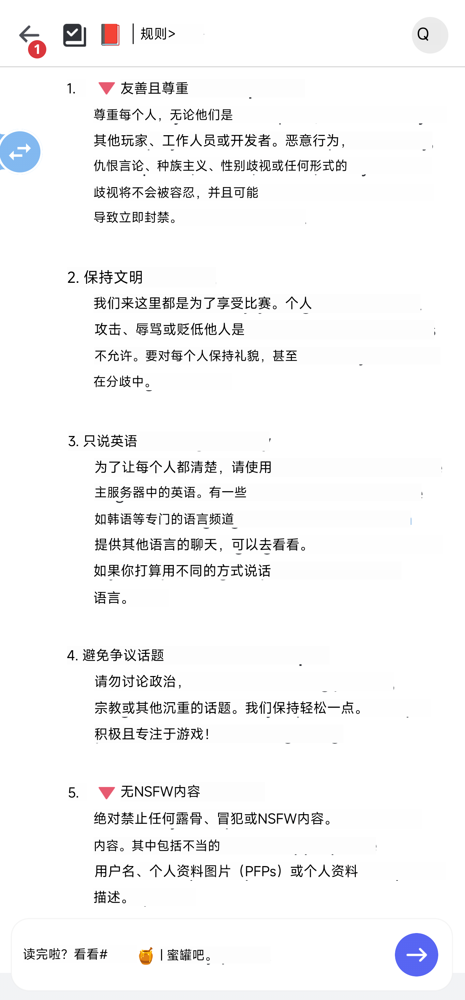 |

**In-game** — The same Sandship screen compared as the original, a source-aligned overlay, and Adapt to screen.

| Display | Preview |
|---|---|
| Original, no processing |  |
| Source-aligned overlay | 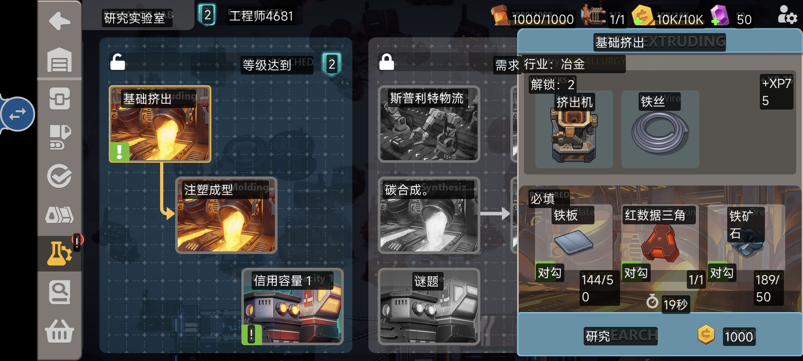 |
| Adapt to screen | 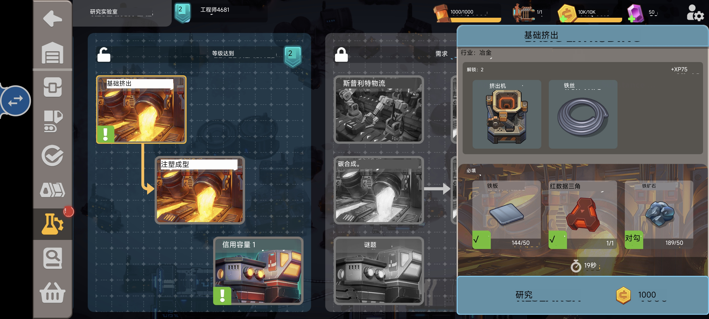 |

**Comic / subtitle scene** — manga bubbles OCR'd by column, translation glued to source:

| Korean manga | Vertical Japanese manga |
|---|---|
|  |  |

**Japanese manga — Adapt to screen comparison** — The same vertical Japanese page shown as the original, with Adapt to screen, and with the translated text changed to a horizontal left-to-right layout:

| Original | Adapt to screen | Adapt to screen (horizontal, left-to-right) |
|---|---|---|
| 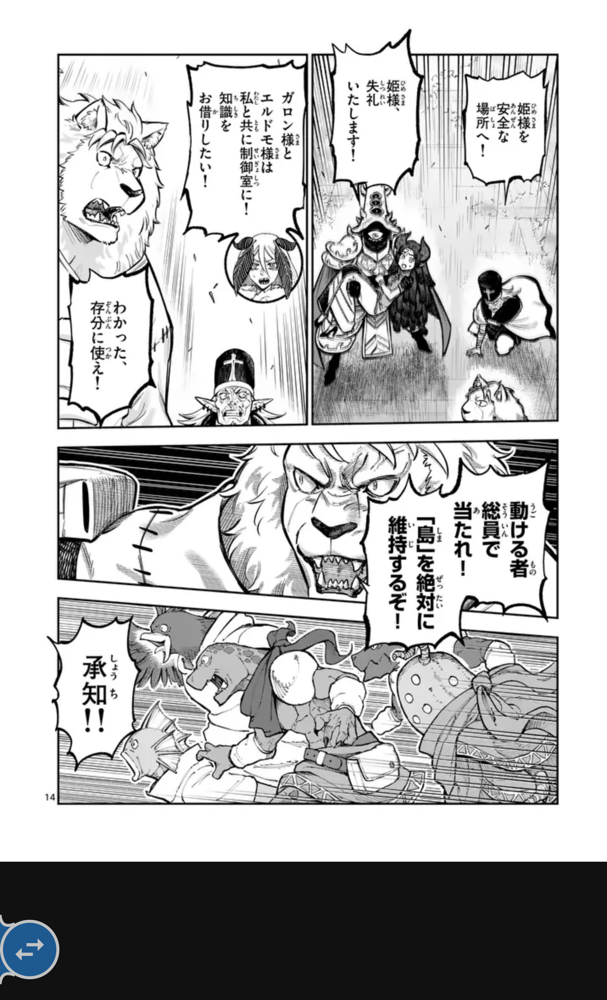 | 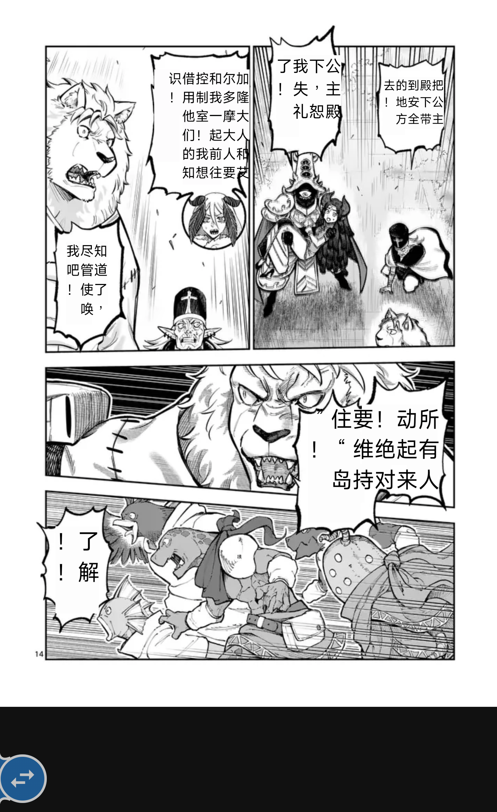 | 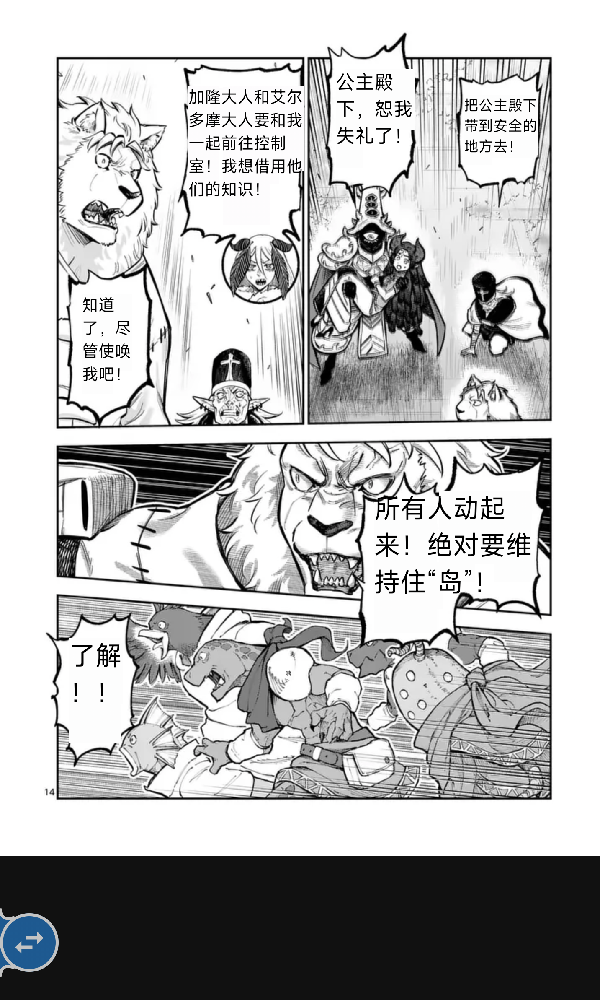 |

**Settings**:

| Language / theme / system presets | Translation backend |
|---|---|
| 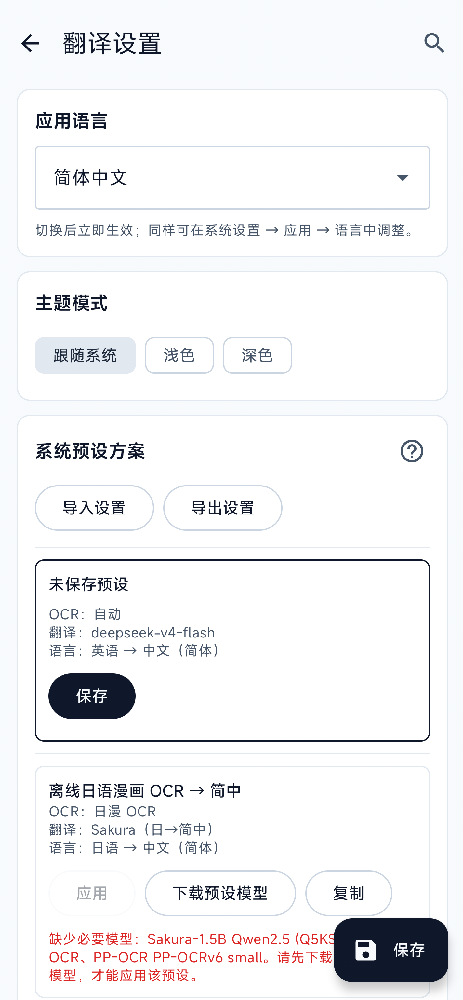 | 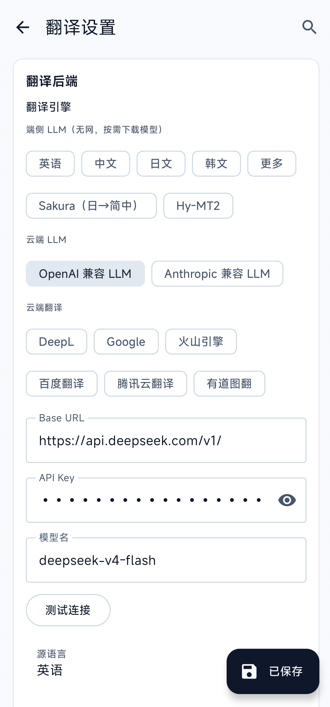 |
| **OCR engines** | **Orientation model settings** |
| 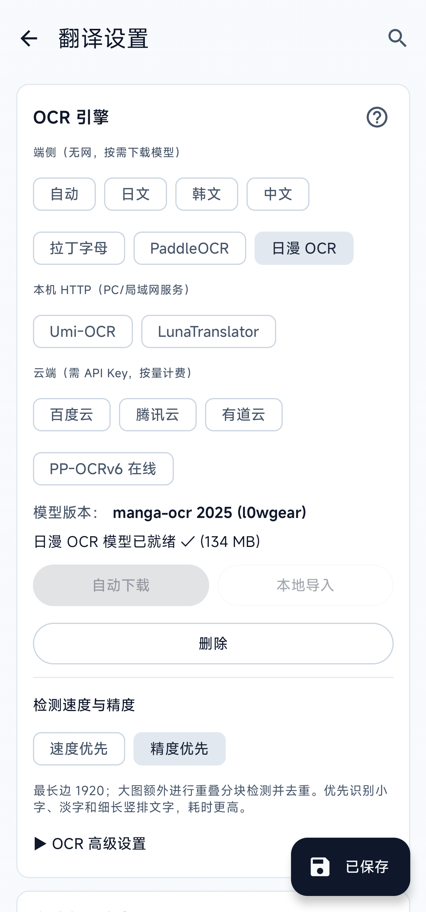 | 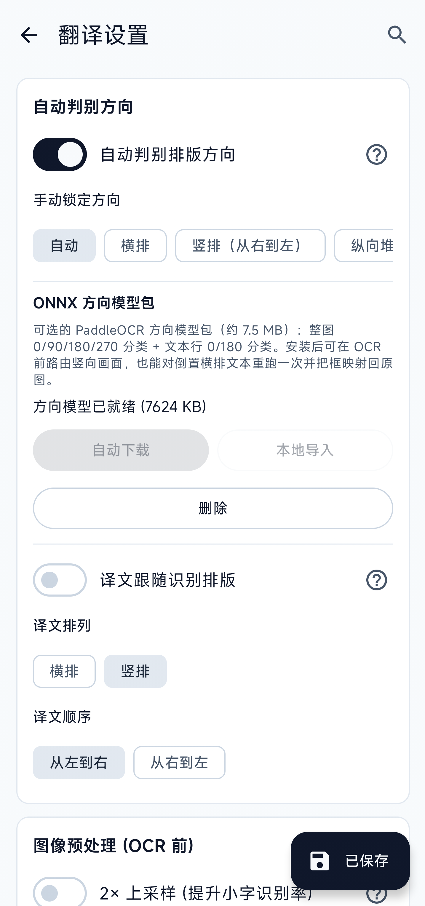 |
| **Overlay style and font** | **Adapt to screen** |
| 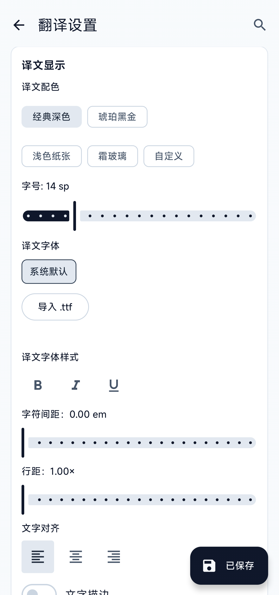 | 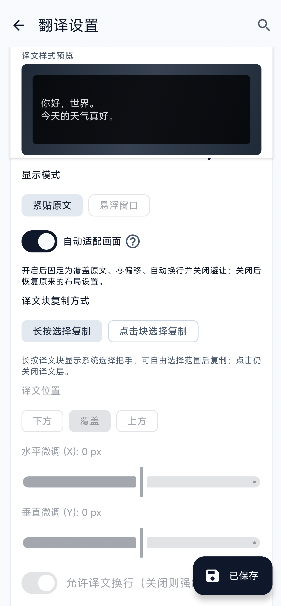 |
| **Arc-menu buttons** | **Floating-window mode options** |
| 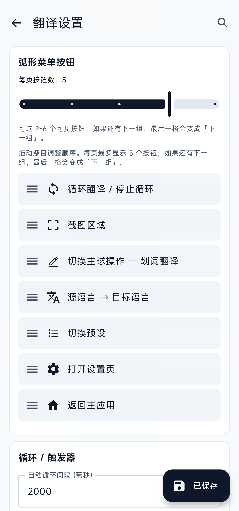 | 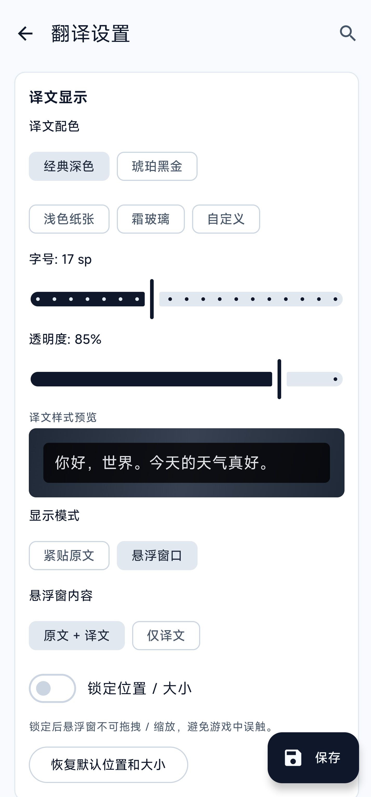 |
| **Box merge / floating ball** | **Smart loop translation** |
|  | 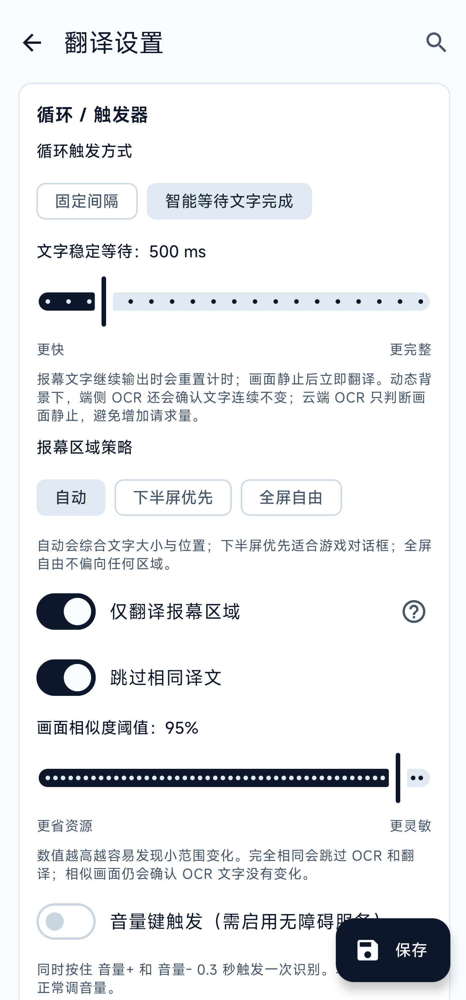 |

**Floating-window mode** — collects all source / translated lines into one draggable, resizable overlay so translations don't cover game controls (joysticks, action buttons, dialog-advance keys). The window can be **locked**: unlocked shows a close button + bottom resize handle and accepts drag / pinch; locked strips them away, leaving only the text and ignoring every gesture — no more accidental drags during gameplay.

| Unlocked (drag / resize / close) | Locked (gesture-proof, content only) |
|---|---|
| 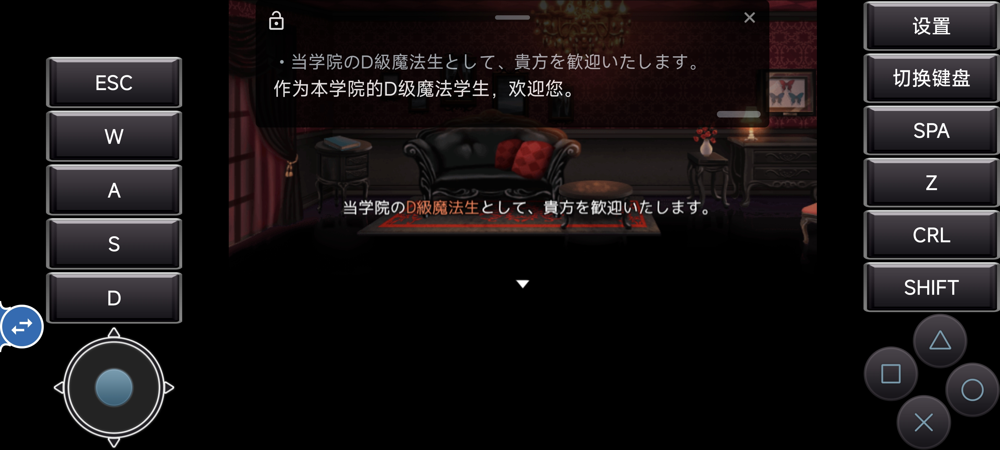 | 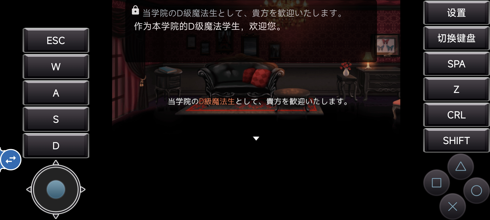 |

**Arc menu (long-press) & word-lookup card** — Left: the arc menu that fans out when you long-press the ball: loop / re-pick region / switch between "Translate full screen" and "Translate a word" / back to main app (the button order is freely reorderable in settings). Right: the card you get after circling a single word on screen — pronunciation, part of speech, multiple definitions and example sentences (the full dictionary requires an LLM-based engine).

| Arc menu on long-press | Word-lookup card (with mini dictionary) |
|---|---|
| 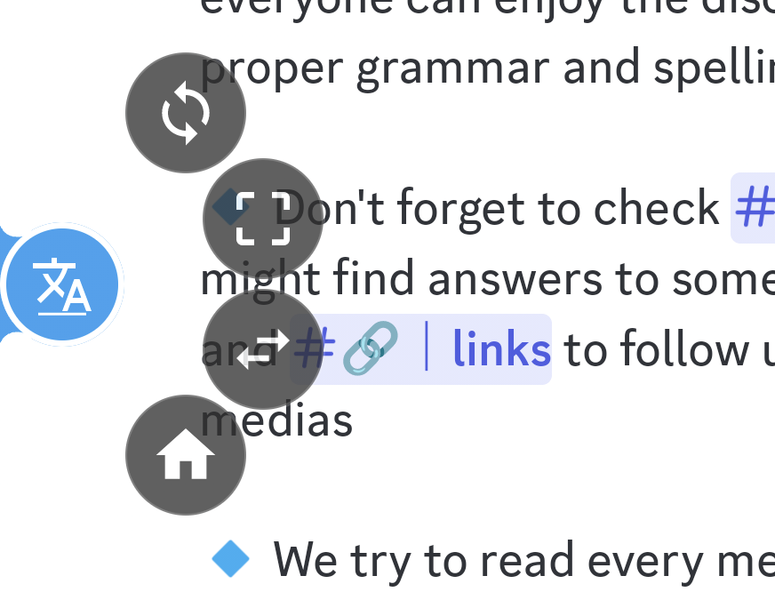 | 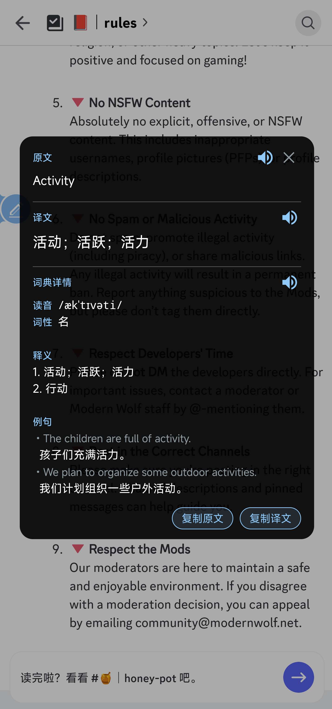 |

## 📦 Install

1. Grab the latest `ScreenTranslator-x.y.z.apk` from [Releases](../../releases)
2. Tap it on your Android device (first time you'll need to allow "Install unknown apps" in system settings)
3. Grant **Overlay** and **Notification** permissions on first launch

Only **`arm64-v8a` (64-bit ARM)** is published. armeabi-v7a / x86 are **not supported for now** — on-device OCR engines (PaddleOCR / ML Kit) ship large native libs, and 32-bit ARM lacks 64-bit NEON optimizations and has fewer registers, making inference noticeably slower and OCR wait times much longer. If you have a 32-bit device that needs this, please open an issue.

Each APK ships with a `.sha256` so you can verify integrity against `Get-FileHash` / `sha256sum`.

## 🚀 Usage

1. Open the app, tap **Start capture service**, accept the system "Start recording?" dialog
2. Switch to any game / VN / manga app
3. Tap the floating button → translation appears in ~2-3 s
4. Long-press the floating button → open the arc menu to toggle loop mode, re-pick the capture region, switch source/target language, switch presets, or toggle between full-screen and word-pick translation (loop can use a fixed interval or translate as soon as text stabilizes)
5. By default, tap a translation block to hide it or long-press to select and copy; Settings can instead make taps open the source / translation copy panel

Optional:
- Enable the accessibility service so **holding Vol+ and Vol- together for 300 ms** acts as a global trigger. The service does not inspect accessibility text or view trees from other apps; Screen Translator's own primary overlays expose TalkBack labels, state, and action hints.
- Install [Shizuku](https://github.com/RikkaApps/Shizuku) and grant permission; in settings, switch the capture path to Shizuku to skip the per-session system dialog. Capture prefers the raw-pixel path and falls back to PNG for compatibility.
- Pick a system preset at the top of settings, such as "Offline Japanese manga OCR → Simplified Chinese". If a required model is missing, the preset card lists it and offers a download action.
- For single-word lookup, switch the floating-ball action to **Word-pick mode** from the arc menu, then draw around the word / phrase. You can also select text in another app and invoke Screen Translator from the system selection menu.

## ⚙️ Configuration

Open the app and tap **Settings**. The top of the settings page lets you switch **App language** and **Theme**; any section is reachable through the search icon, matching both Chinese and English keywords.

### OCR engines

| Engine | Good for | Notes |
|---|---|---|
| **On-device** ML Kit (auto / latin / ja / zh / ko) | Default; Japanese / Chinese / Korean / Latin | Offline, on-device |
| **On-device** PaddleOCR PP-OCRv5 / v6 | Multilingual dense text, UI buttons, horizontal Chinese / English | Supports v5 mobile and v6 tiny / small / medium; models must be ready — see below |
| **On-device** manga OCR | Japanese manga, vertical bubbles, hand-drawn fonts | Uses manga-ocr ONNX and reuses DBNet detection; ~140 MB, downloadable or importable |
| **Local HTTP** Umi-OCR | You already run [Umi-OCR](https://github.com/hiroi-sora/Umi-OCR) on a PC / LAN server | Point the app at `http://<host>:<port>/api/ocr`; screenshots stay on your LAN |
| **Local HTTP** LunaTranslator | You already run [LunaTranslator](https://github.com/HIllya51/LunaTranslator) OCR on a PC / LAN server | Fill in the LunaTranslator OCR HTTP endpoint |
| **Cloud** PP-OCRv6 Online | Chinese, Japanese, and Latin-script languages | Uses the PaddleOCR AI Studio asynchronous `PP-OCRv6` jobs API; requires an AI Studio Access Token |
| **Cloud** Baidu OCR | Fallback when ML Kit / Paddle miss | Needs API Key + Secret, pay-per-call; 5 endpoints (basic / with-position / accurate / accurate-with-position / web-image); image size / aspect-ratio limits |
| **Cloud** Tencent OCR | Same | Needs SecretId + SecretKey; 3 endpoints: GeneralBasic / GeneralAccurate / **RecognizeAgent** (LLM agent, integrated with ParagNo paragraph grouping) |
| **Cloud** Youdao OCR | Simple one-tap | Needs App ID (API Key) + App Secret; `langType` auto-derived from source language, no separate picker |

<details>
<summary><strong>On-device OCR benchmark</strong></summary>

Test conditions:

- Device: Qualcomm Snapdragon 8 Gen 3 with 16 GB RAM
- Test image: the same full-screen `1440×3200` Japanese manga screenshot for every model
- Preprocessing and text merging disabled; Debug build with detailed performance logging enabled
- “OCR time” is the engine's recognition time. “Complete pipeline” also includes capture, orientation detection, any required model switch, and rendering.
- These measurements come from one device and one image. They compare on-device models within this project and are not universal performance estimates.

#### Speed priority

| OCR model | OCR time | Complete pipeline | Result on this test image |
|---|---:|---:|---|
| PP-OCRv5 Mobile | 1.17 s average | 2.30 s average | 34 segments; reasonable speed, but many wrong, missing, or garbled characters |
| PP-OCRv6 Tiny | 0.65 s | 2.00 s¹ | 29 segments; fastest, but Japanese recognition was largely unusable |
| PP-OCRv6 Small | 0.84 s | 2.51 s¹ | 35 segments; best overall PaddleOCR result, with most body text recognized correctly |
| PP-OCRv6 Medium | 3.60 s | 6.36 s¹ | 35 segments; recovered some body text, but still had recognition and splitting errors |
| Manga OCR | 5.54 s | 6.45 s | 17 complete bubbles; best vertical grouping, sentence integrity, and overall accuracy |

¹ The complete pipeline includes switching from and loading the previous PaddleOCR model: about 0.44 s for Tiny, 0.77 s for Small, and 1.80 s for Medium.

#### Accuracy priority

| OCR model | OCR time | Complete pipeline | Compared with Speed priority |
|---|---:|---:|---|
| PP-OCRv5 Mobile | 3.08 s | 4.24 s | Found 5 more segments, but added false positives and garbled text |
| PP-OCRv6 Tiny | 1.81 s | 3.02 s | Found more boxes, but Japanese remained largely unusable |
| PP-OCRv6 Small | 4.01 s | 5.35 s | Recovered a little small text, while adding several false positives |
| PP-OCRv6 Medium | 16.85 s | 18.16 s | Kept only 2 more segments at a very high time cost |
| Manga OCR | 5.73 s average | 7.00 s average | 21 segments; recovered more small text and improved the difficult bottom area, with some added noise |

For this image, **PP-OCRv6 Small with Speed priority** offered the best balance of speed and Japanese recognition quality. Use **Manga OCR** when vertical manga layout and accuracy matter more. None of the PaddleOCR Accuracy profiles produced a consistent accuracy gain in this test.

</details>

<details>
<summary><strong>On-device translation benchmark</strong></summary>

Test conditions:

- Device: Qualcomm Snapdragon 8 Gen 3 with 16 GB RAM
- The same 18 Japanese OCR segments translated into Simplified Chinese
- “Disable translation cache” enabled in Developer options; both runs reported zero cache hits
- CPU inference at TG=6 / PP=6; native JNI B4 batching in 5 groups (4+4+4+4+2)
- The app was force-stopped before each model run. Opening floating translation automatically loaded and prewarmed the selected model.
- “First shown” and “All 18 complete” start at translation batch submission and exclude OCR time. Results were collected from a Debug build.

| On-device model | Model file | Cold prewarm | First shown | All 18 complete | Result on this test text |
|---|---:|---:|---:|---:|---|
| Sakura 1.5B (Q5_K_S) | ~1.20 GB | 2.99 s | 3.40 s | 10.30 s | More natural Chinese, but one negation was reversed and one time expression was mistranslated |
| Hy-MT2 1.8B (Q4_K_M) | ~1.08 GB | 2.38 s | 3.51 s | 10.84 s | Handled negation and the time expression better, but had weaker context, long-sentence, and Chinese phrasing quality |

Sakura showed its first batch about 0.11 s sooner and finished all segments about 0.54 s sooner. Hy-MT2 completed cold prewarming about 0.61 s sooner. Sakura produced more natural Chinese in this sample, while Hy-MT2 handled some semantic details more accurately. Hy-MT2 used a 512 MiB KV buffer versus Sakura's 224 MiB, which matters on devices with less memory.

</details>

**PaddleOCR models**: the first use requires a download or local import. The default is **PP-OCRv5 mobile**. You can switch versions to suit the screen and language:

- **v5 mobile**: the default, supporting Simplified Chinese, Traditional Chinese, English, and Japanese
- **v6 tiny**: the smallest and fastest, with many Latin-script languages but no Japanese support
- **v6 small**: a balance of speed and accuracy, with Japanese support
- **v6 medium**: larger and slower, for faster devices where a longer wait is acceptable

**PP-OCRv6 Online**: this is a cloud recognition service. It needs an AI Studio Access Token but does not need the on-device models above. Screenshots are sent to PaddleOCR's online service when it is used.

**Orientation models**: these detect rotated screens and upside-down text. They are included with the app, so no extra download is needed when they show as ready.

**Manga OCR models**: the first use requires a download or local import. The main public source is Hugging Face; if it is unavailable on your network, use a proxy, custom mirror, or local import.

**Downloads and ready state**: PaddleOCR, manga OCR, orientation, and offline translation models can download in the background. Downloads continue after leaving Settings, and both the app and system notification show progress. You can cancel at any time; interrupted downloads retry and continue from where they stopped. A model can be used when it shows as ready. Delete the installed model first if you want to replace it.

**Automatic orientation detection**: enabled by default. It chooses horizontal or vertical text from the screen and language. If it gets a page wrong, select horizontal, vertical Japanese, or another direction manually.

**Detection speed and accuracy**: "Speed" is the default. Switch to "Accuracy" when tiny, faint, or narrow vertical text is missed, but expect a longer wait. Most users should leave the advanced OCR settings unchanged; adjust them gradually only if text is repeatedly missed or too many false detections appear.

**On-device performance**: local recognition and translation adjust automatically to the phone. Faster phones wait less, while entry-level devices may take longer; there is no need to set thread counts manually.

**Baidu OCR caveats**: image limits are *longest side ≤ 4096 px, shortest side ≥ 15 px, aspect ratio 1:4–4:1, base64 < 4 MB*. The first two are handled automatically (downscale + JPEG quality fallback); aspect ratio out of range can only be fixed by shrinking the capture region.

### Translation engines

Choose by use case first; you do not need to read every setting before getting started:

| Engine | Best for | What you need | Before you use it |
|---|---|---|---|
| **Sakura (on-device)** | Japanese manga, visual novels, and galgames translated into Simplified Chinese | Download the ~1.26 GB model | Japanese → Simplified Chinese only; works offline but depends on phone performance |
| **Hy-MT2 (on-device)** | Multilingual offline translation | Download the ~1.13 GB model | Source and target follow your settings; low-memory devices may fail to load it |
| **OpenAI-compatible** | Existing DeepSeek, OpenAI, Zhipu, SiliconFlow, Ollama, or compatible services | Base URL, API key, and model name | Supports streaming and custom prompts; pricing and rate limits depend on the provider |
| **DeepL / DeepLX** | Conventional machine translation or an existing self-hosted DeepLX service | DeepL Auth Key or a DeepLX service URL | Official DeepL selects free / pro automatically; Test connection can show quota |
| **Youdao PicTrans** | Comics, full images, and screens with many text boxes | Youdao App ID + App Secret | Translates the screenshot directly and does not use the OCR engine selected above |
| **Google** | A quick trial without entering a key | Nothing | Uses an unofficial endpoint; usually needs a proxy in mainland China and may be rate-limited or stop working |
| **Volcengine** | Long loop-translation sessions | AK / SK with Machine Translation enabled | Keep the default region; this is an online service |
| **Baidu Translate** | General text translation | Baidu Translate APPID + secret | Separate product and account system from Baidu OCR |
| **Tencent Translate** | General translation or an existing Tencent OCR setup | Tencent SecretId + SecretKey | Reuses the same credentials as Tencent OCR |

Every online engine has a **Test connection** action. Use it before switching to your game.

<details>
<summary><strong>How do I fill in an OpenAI-compatible service?</strong></summary>

- **Base URL**: use the provider's OpenAI-compatible endpoint, usually ending in `/v1/`
- **API key**: use the key issued by the provider; it may be left blank for a self-hosted service without authentication
- **Model name**: copy the exact name from the provider console or your self-hosted service instead of guessing from an example
- **Prompt template**: the default is written for conversational game translation. You may customize it; untouched prompts follow the UI language, while edited prompts are never overwritten automatically

</details>

<details>
<summary><strong>On-device model downloads and performance</strong></summary>

- Hugging Face, hf-mirror, custom mirrors, and local model import are supported; background downloads provide notification progress, cancellation, retry, and resume
- Large downloads warn before starting on cellular or an unknown network type
- After capture starts, an installed and selected manga OCR, Sakura, or Hy-MT2 model is prepared in advance to reduce the first wait
- When one screen contains several text blocks, Sakura / Hy-MT2 tries to handle them together and automatically falls back to one at a time when needed
- On-device translation currently relies mainly on the CPU. Sakura's Vulkan option remains an experimental, default-off feature and may not work or run faster on every device
- Sakura / Hy-MT2 are available only on supported 64-bit devices and OS versions

</details>

### Terminology and app context

- **Terminology library**: store a source term, preferred translation, language pair, category, case rule, and enabled state, scoped globally or to one app; filters cover source, translation, app, and category
- **Foreground app detection**: choose Auto, Accessibility, Usage access, or Global only. Package names are used only for on-device terminology matching and are never sent to translation services; "Send app name to the model" is a separate opt-in
- **Supported engines**: app names and terminology context currently apply only to OpenAI-compatible and on-device LLM translation; plain machine-translation engines keep their existing request format

### Loop translation

- **Trigger mode**: Fixed interval runs at the configured millisecond interval; "Wait for text completion" resets its timer while dialogue is still typing and translates as soon as text stabilizes
- **Animated backgrounds**: on-device OCR can verify that text remains unchanged even while the frame animates; cloud OCR uses frame stability only, avoiding extra paid verification requests
- **Dialogue region**: choose Auto, Lower screen first, or Anywhere, then decide whether to translate only that region or use it for stability while translating all text recognized in the first frame
- **Duplicate skipping**: exact frame matches skip both OCR and translation; similar frames still verify whether OCR text changed, with an adjustable sensitivity threshold

### Display

- **Render mode**: BLOCKS (per OCR box, glued to source) / **Floating window** (a draggable, resizable overlay — see the [screenshots section](#-screenshots))
- **Placement** (BLOCKS only): below / overlap / above + pixel-level x/y offset
- **Translation layout**: "Follow recognized text layout" is enabled by default, so horizontal / vertical layout and reading order jointly drive OCR-block sorting and translated-text rendering; turn it off to explicitly choose horizontal / vertical and LTR / RTL, including vertical manga and horizontal RTL
- **Block interaction**: the default is tap-to-close plus long-press range selection; an alternate mode makes taps open a panel where you can select or copy the full source / translation
- **Floating window**: switch between "source + translation" and "translation only" content modes; **lock** the window to disable dragging and resizing during gameplay; a "Reset position / size" button restores defaults in one tap
- **Theme**: 5 presets + a visual custom color picker for independent background / text / border color and opacity; borders support solid / dashed / dotted / double / groove styles
- **Text style**: bold / italic / underline, letter spacing, line spacing, left / center / right alignment, outline width and color, plus shadow radius / offset / color
- **Font**: import `.ttf` files for the translation layer and preview only; imported fonts are kept as horizontally selectable chips, and reselecting an existing font does not reorder them
- **Avoidance & merge**: collision detection clamps translation width so it doesn't bleed into neighbouring OCR boxes; OCR-side box merging offers **Conservative / Standard / Aggressive** strengths — Conservative suits VNs / dense passages, Standard fits most scenes, Aggressive suits comic bubbles split into many columns (may occasionally merge adjacent bubbles)

### Presets and Arc Menu

- **System presets**: built-in bundles such as "offline Japanese manga OCR → Simplified Chinese" set up recognition, translation, language, and display in one step. The manga preset uses Adapt to screen by default, and lists missing models for download.
- **Custom presets**: save the current settings as a preset. A preset only shows as applied when all key settings still match; changing any key field returns the card to the unsaved state.
- **Arc-menu buttons**: drag to reorder and choose 2-6 visible buttons per page. If there are more actions, the last slot becomes "Next page". Actions can include loop, capture region, word/full-screen mode switch, language quick switch, preset quick switch, settings, and back to main app.

### Backup and migration

- **Complete settings bundle**: `.otsettings` exports all non-credential settings, custom presets, terminology entries, and imported `.ttf` fonts for device migration or configuration sharing
- **Secrets stay on-device**: API keys, tokens, secrets, access IDs, and app IDs are excluded; importing preserves credentials already stored on the destination device
- **Legacy preset support**: older `.otpresets` files remain importable; the new bundle validates imported data and de-duplicates preset names
- **Model choices, not binaries**: selected models, mirrors, and tuning values are exported, but multi-gigabyte model files are not; download or locally import them on the destination device

### Accessibility and diagnostics

- **TalkBack**: primary overlay entry points expose readable labels, toggle state, and double-tap / long-press actions; region selection announces state and dimensions, while complex menus are read row by row
- **Word card**: the top close bar and bottom copy bar stay fixed while the body scrolls; landscape sizing subtracts system bars and cutout insets so actions are not clipped
- **Crash logs**: in addition to Java exceptions, Android 11+ imports system-reported native crashes, ANRs, low-memory exits, and signal exits; settings snapshots are sanitized and system traces are read with a size limit
- **Developer diagnostics**: you can save the screenshots used by OCR to investigate missed or incorrect text. This is off by default, saves at most 8 screenshots per app run, and may capture private content. You can also temporarily disable the translation cache so every test translates again

## ⚠️ Known limitations

- Android 14+ shows a system permission dialog on every fresh capture session — that's by design. The Shizuku path avoids it.
- Some ROMs (Xiaomi / OPPO / VIVO) kill background services or block overlays by default. You need to whitelist battery + allow background start manually. The app provides in-product shortcuts.
- Anti-cheat networked games may flag MediaProjection as a screen-recorder cheat — this project is for single-player / VN / manga only.
- Screens marked `FLAG_SECURE` (some banking / video apps) capture as black; this project does not bypass it.
- PaddleOCR on-device inference takes 1–3 s per shot on entry-level devices (Snapdragon 7-series or lower). Use region selection alongside.
- On-device LLM models are roughly 1 GB or larger, so first download should use Wi-Fi; low-memory devices may fail to load them reliably.
- Production on-device OCR and LLM inference is currently CPU-first and does not yet use Qualcomm QNN / NPU. Sakura's Vulkan path remains an experimental, default-off option and is not guaranteed to work or run faster on every device.
- The public manga-OCR source is mainly Hugging Face. If it is unreachable from your network, use a proxy, custom mirror, or local import.
- TalkBack covers the primary overlay workflow, but full-screen OCR text is not yet exposed as individually navigable system accessibility nodes.

## 🗺️ Roadmap

### ✅ Available now

| Feature | What users can do |
|---|---|
| **Floating translation** | Tap the floating ball over a game, manga, or visual novel and show translations beside the source or in a separate floating window |
| **Adapt to screen** | Choose translation colors, background, and text size for each area, then place the translation back over the source text |
| **Automatic loop** | Translate at a fixed interval or wait for dialogue to finish typing; skip unchanged screens and optionally prioritize lower-screen dialogue boxes |
| **Multiple OCR choices** | Use on-device ML Kit / PaddleOCR / manga OCR, connect to OCR on your LAN, or use Baidu, Tencent, Youdao, and PP-OCRv6 Online |
| **Horizontal and vertical text** | Detect rotated, horizontal, and vertical manga text; follow the recognized layout or manually choose layout and reading direction |
| **Multiple translators** | Use OpenAI-compatible services, DeepL, Google, Volcengine, Baidu, Tencent, Youdao PicTrans, or offline Sakura / Hy-MT2 models |
| **Copy translations** | Long-press to select a range, or tap a block to open a panel and copy part of the text, the full source, or the full translation |
| **Word lookup** | Select a word or phrase for a translation; LLM engines can also return pronunciation, part of speech, definitions, examples, and usage notes |
| **Consistent names and terms** | Save global or per-game names, places, and terminology so wording stays consistent across scenes |
| **Model downloads** | Download on-device models in the background, view progress in the app and notification, cancel, retry, or resume interrupted files |
| **Faster local translation** | Prepare offline models after capture starts and handle several text blocks together when possible to reduce waiting |
| **Customization and migration** | Adjust colors, fonts, size, outline, and shadow; export settings, presets, terminology, and fonts for another device |
| **Assistive features** | Trigger with both volume keys, use TalkBack action hints, export crash logs, and open background-running guides for aggressive Android ROMs |

### 📋 Next directions

These are user-facing improvements we want to continue working on, not a fixed release order:

| Direction | Intended experience |
|---|---|
| **Translation speech (TTS)** | Play a translation directly from each block with clear play / stop state |
| **Translation history** | Revisit previously translated screens and dialogue instead of losing the last line after switching scenes |
| **Offline dictionary** | Show basic definitions and examples without a network connection or an LLM translator |
| **Continue improving local translation** | Further reduce waiting, heat, and battery use during long sessions |
| **Deeper accessibility** | Make full-screen OCR text and dynamic translations individually navigable with a screen reader |

## 🤝 Contributing

Contributions of any kind — bug fixes, features, UI polish, translations, doc tweaks — are welcome.

### Branch & PR rules

> ⚠️ **Do not open PRs against `main`.**
>
> `main` is the stable trunk that drives releases; **only maintainer-reviewed merges land there**.
>
> External contributors:

1. **Open an issue first** to discuss direction — avoid wasted work / scope mismatches
2. **Fork** the repo, branch off the latest `main`:
   ```bash
   git checkout -b feat/your-idea origin/main
   ```
3. **Develop and test locally** (at least `./gradlew installDebug` on a real device)
4. **Open the PR against `dev`** (if `dev` doesn't exist yet, ping the maintainer in the issue to create it). The maintainer aggregates multiple PRs on `dev`, retests, then merges into `main`
5. **Direct push / force-push to `main` is forbidden** (enforced by branch protection)

### Build locally

```bash
git clone https://github.com/ciddwd/overlay-translator.git
cd overlay-translator
cp local.properties.example local.properties
# Edit local.properties and point sdk.dir at your local Android SDK
./gradlew installDebug   # installs onto the connected device
```

Requires JDK 17 + Android SDK 35. Opening the project in Android Studio auto-syncs and fills in the Gradle wrapper jar; on a bare CLI environment, run `gradle wrapper --gradle-version 8.10.2` first.

### Translation contributions

To add a new language or fix an existing one:

1. Copy `app/src/main/res/values/strings.xml` to `app/src/main/res/values-<lang>/strings.xml` (e.g. `values-zh-rTW`, `values-ja`)
2. Translate the **values** inside `<string>` tags only. **Keep** the `name="..."` key and placeholders (`{source}`, `{target}`, `%1$s`, `\n`, etc.)
3. Add `<locale android:name="<lang>" />` to `app/src/main/res/xml/locales_config.xml`
4. Append a row to `APP_LANGUAGE_OPTIONS` in `app/src/main/java/com/gameocr/app/ui/SettingsScreen.kt`
5. In the PR description, attach coverage (X / Y strings translated) and screenshots of the localized settings page

We may migrate to [Weblate](https://weblate.org/) when there are 10+ languages.

### Commit messages

Use a simplified [Conventional Commits](https://www.conventionalcommits.org/):

```
feat: new feature
fix:  bug fix
docs: documentation
refactor: refactor (no behaviour change)
chore: build / CI / tooling
i18n: translations
```

Write the subject in either English or Chinese — **don't mix in one line**. Keep the first line ≤ 72 chars.

### Code of conduct

- Be civil, stay on topic
- No off-topic content, ads, or politics
- Maintainers reserve the right to close issues / PRs that don't match the project direction, with a brief reason

## 🙏 Acknowledgements

### Upstream

- [PaddleOCR](https://github.com/PaddlePaddle/PaddleOCR) · PP-OCRv5 mobile model
- [bukuroo/PPOCRv5-ONNX](https://huggingface.co/bukuroo/PPOCRv5-ONNX) · ONNX-converted v5 mobile mirror
- [l0wgear/manga-ocr-2025-onnx](https://huggingface.co/l0wgear/manga-ocr-2025-onnx) · manga-ocr ONNX model
- [kha-white/manga-ocr](https://github.com/kha-white/manga-ocr) · original manga-ocr project
- [ggml-org/llama.cpp](https://github.com/ggml-org/llama.cpp) · GGUF / on-device LLM inference
- [SakuraLLM/SakuraLLM](https://github.com/SakuraLLM/SakuraLLM) · Sakura Japanese-to-Chinese translation model
- [Tencent-Hunyuan/HY-MT](https://github.com/Tencent-Hunyuan/HY-MT) · Hy-MT translation model
- [Shizuku](https://github.com/RikkaApps/Shizuku) · privileged channel without ROOT
- [ML Kit](https://developers.google.com/ml-kit) · Google's on-device OCR
- [ONNX Runtime](https://onnxruntime.ai/) · on-device inference engine
- [Jetpack Compose](https://developer.android.com/jetpack/compose) / [Material 3](https://m3.material.io/) · UI stack
- [Hilt](https://dagger.dev/hilt/) · dependency injection
- [Retrofit](https://square.github.io/retrofit/) + [OkHttp](https://square.github.io/okhttp/) · networking
- [kotlinx.serialization](https://github.com/Kotlin/kotlinx.serialization) · JSON
- [Timber](https://github.com/JakeWharton/timber) · logging

### Contributors

<a href="https://github.com/ciddwd/overlay-translator/graphs/contributors">
  
</a>

(Will appear automatically after the first PR is merged.)

### Inspiration

PC tools in the VNR / Visual Novel Reader family have served galgame / VN players for years. This project carries that pipeline to Android, redesigned for the phone (battery, ROM constraints, touch UI).

## 📄 License

Code is licensed under [Apache-2.0](LICENSE). Models and third-party dependencies retain their own licenses.
