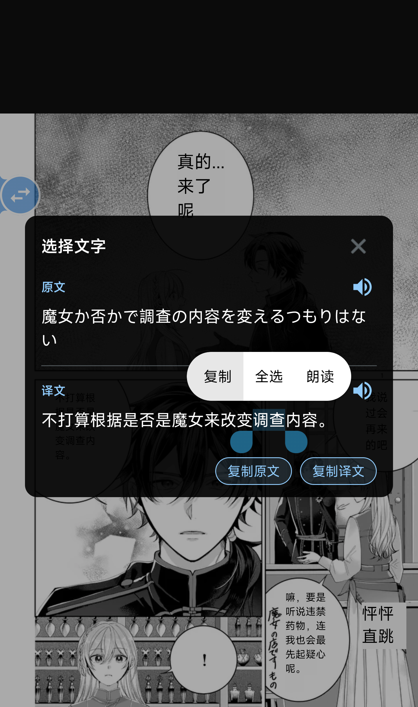
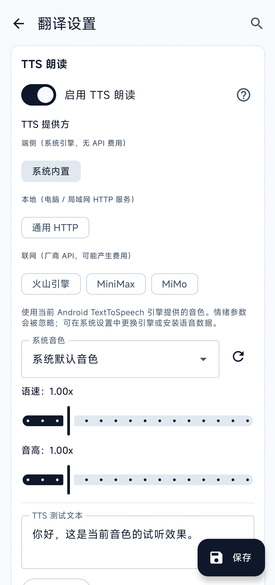

<div align="center">

**简体中文** · [English](README.en.md)

# 屏译 · Screen Translator

**Android 屏幕实时翻译 · 截屏 → 识字 → 翻译 → 叠加显示 / 朗读**

[](LICENSE)
[](../../releases)
[](../../releases)
[](https://github.com/ciddwd/overlay-translator)
[](../../issues)


[](https://qun.qq.com/universal-share/share?ac=1&authKey=%2Fs0%2FaO4mEHsgutzjUnhGIQEWLcAcGPXTefUY2YwdMkPdnHHuB%2FpLZm9hPjcrw6n5&busi_data=eyJncm91cENvZGUiOiIxMDU5NjU1OTI2IiwidG9rZW4iOiJ4b25nS0FvSFQyMko4WjJTMHhGRlIwSnppeVB2eGJCNjFua0FDTGZzNUhEWlY3VkdPcFVaOEdMams0aEY3aFBTIiwidWluIjoiNTcyMjQyOTk4In0%3D&data=j7H7DHUunIEqMXYLZxhTkx-K_LZTTs5aBJS95LT_Y50uQy37d5IiUU2y3gAPcy9CYRzRufvHuTCaSHOQsLTkTw&svctype=4&tempid=h5_group_info)

通过 MediaProjection / Shizuku 截屏 → 端侧或云端 OCR → LLM / 机器翻译 → 悬浮窗叠加显示。
译文既可以盖在原文附近，也可以用手机语音、自建语音服务或在线音色朗读。
无需 ROOT，单机可用，面向视觉小说、漫画、游戏对话等任意屏上文字的实时翻译。

[安装](#-安装) · [使用](#-使用) · [配置](#-配置) · [参与开发](#-参与开发) · [Releases](../../releases) · [Issues](../../issues)

</div>

---

## ✨ 功能

### 🎯 一句话定位

游戏 / 漫画 / 视觉小说画面在屏，按一下圆球，识别和翻译完成后，目标语言译文盖在原文上；需要时还能直接朗读。

### 🖱️ 怎么触发翻译

- **悬浮球单击**：默认翻整个屏幕；可切到「划词模式」——按一下后用手指圈一小块文字单独翻（更准、专挑要看的那一段）
- **悬浮球长按**：弹出弧形子菜单，常用动作一指可达：循环翻译 / 重选区域 / 在「全屏翻译」和「划词翻译」之间切换 / 快速切源语言与目标语言 / 切换翻译预设 / 打开设置 / 回主页。**按钮顺序和每页数量可在设置里调整**；超过一页自动出现「下一组」翻页按钮
- **循环模式**：可选固定间隔，或等待报幕文字稳定后再翻译；会跳过完全相同的画面 / 译文，并可优先检测下半屏对话区域，连续看剧情时不用反复点球
- **音量双键**：同时按住「音量+ / 音量−」0.3 秒触发，手指不用离开游戏（需在系统无障碍中启用）
- **从其它 App 选中文字**：在任意 App 里长按选中一段文字 → 系统菜单选「屏译翻译」→ 直接弹译文卡片，省去切到屏译再框选的步骤

### 🔍 识别屏上的文字（OCR）

- **本机识别**：ML Kit（中日韩英）/ PaddleOCR / 日漫 OCR——图不上传，无网也能用；PaddleOCR 支持 v5/v6 多档模型
- **本地 HTTP OCR**：可接入局域网里的 Umi-OCR / LunaTranslator OCR 服务，适合把 PC 端 OCR 能力接到手机截屏流里
- **云端识别**：PP-OCRv6 在线（PaddleOCR AI Studio）/ 百度 / 腾讯 / 有道——本机识不准时兜底；PP-OCRv6 在线需填写 AI Studio Access Token
- 切源语言时会自动检查"当前 OCR 能不能认这门语言"，认不了会推荐换引擎，不用自己排查
- 可自动判别横排 / 竖排 / 旋转文本方向，必要时重跑更合适的 OCR 路径；也可以手动锁定方向
- PaddleOCR、日漫 OCR 和方向模型会按设备可用核心数动态选择 1 / 2 / 4 / 6 个 CPU 推理线程，最高 6 线程

### 🌐 翻译引擎

- **大语言模型**：DeepSeek / ChatGPT / Claude / 智谱 / 自建服务……支持 OpenAI 或 Anthropic 兼容方式，一边翻一边显示
- **本机翻译**：Google ML Kit 下载语言包后可离线使用；Sakura 适合日语漫画和视觉小说翻简中，Hy-MT2 支持更多语言
- **译名一致性**：可按全局或指定 App 保存人名、地点、组织和专业术语，让大语言模型和本机模型在连续剧情中使用固定译名
- **DeepL**：官方付费 / 免费版自动识别，**支持自架 [deeplx](https://github.com/OwO-Network/DeepLX)**（免 key 的开源代理，能在自己服务器上跑），可选「官方 / deeplx / 自动 fallback」三种协议
- **有道图翻**：截图直接换译文，跳过中间环节，特别适合漫画
- **Google**：免 key、免费（国内需代理）
- 联网引擎都可以先「测试连接」，DeepL 还能显示当前额度

### 🔊 把译文读出来（TTS）

- **手机系统语音**：不需要注册账号，直接使用手机里已有的声音，还能调整语速和音调
- **更多声音选择**：也可以使用自己部署的语音服务，或火山引擎、MiniMax、MiMo 等在线服务；在线服务可能收费
- **能读哪些内容**：原文、译文、划词卡片和字典内容都能朗读；横排文字还可以只选中其中一段来读
- **播放控制**：再次点击同一段即可暂停或继续；点击另一段会改读新内容，失败时会直接说明原因。部分手机厂商的系统语音不会提供朗读位置，继续时只能从头读这一段
- TTS 默认关闭，不想使用朗读功能时不会影响识别和翻译

### 🔤 划词翻译（按一个词出字典）

不只是翻整屏。框出屏上一个单词或短语，弹卡片一次告诉你：

- **译文** —— 所有翻译引擎都给
- **音标 / 词性 / 多条释义 / 例句对照 / 难点解释** —— **使用大语言模型时**才有完整字典；生僻词、专业名词、缩写、文化背景和易混用法会单独说明（百度 / 腾讯 / DeepL 这类只返回译文）
- 卡片上有「复制原文」「复制译文」两个按钮，长按文字也能复制
- 横屏时顶部关闭栏和底部复制栏固定，中间内容单独滚动，并自动避开状态栏、导航栏和刘海区域
- 适合查游戏 / 漫画 / 视觉小说里冒出来的生词，单词长按一秒，比切回字典 App 快得多

### 🎨 译文怎么显示

- **两种渲染**：贴每段原文下 / 上 / 覆盖（BLOCKS），或装进一个可拖拽缩放的**悬浮窗口**（适合虚拟按键密集的游戏，让译文飘在画面上方不挡操作；可一键锁定避免误触）
- **自动适配画面**：紧贴原文显示时，根据每个文字区域自动选择颜色、背景和字号，并尽量把译文放回原文位置；关闭后恢复原来的显示设置
- **排版与阅读顺序统一**：默认让译文跟随 OCR 识别出的横排 / 竖排及阅读顺序；关闭后必须手动选择横排或竖排，以及从左到右或从右到左，OCR 块排序和译文渲染共用同一方向
- **译文块可复制**：可选长按译文块调用系统文字选择，或点击译文块打开选择面板，按范围选择文字，也能整段复制原文 / 译文
- **5 套配色 + 可视化取色器**：直接选择背景、文字、边框颜色和透明度，不需要手填 ARGB；横屏下取色面板可滚动
- **完整文字样式**：加粗、倾斜、下划线、字符间距、行距、对齐、描边和阴影都可独立调整，预览与实际译文同步
- **漫画 / 字幕优化**：自动把被切成几段的同一句话合到一起再翻；竖排日漫从右往左拼；漢字旁的小注音（振假名）自动去掉，译文不再重复；竖排场景可用竖排译文布局
- **长译文跑马灯**：单行模式下太长不会被省略号截断，自动横向滚动
- **译文字体自选**：导入 `.ttf` 后只作用于译文渲染，系统 UI 仍使用默认字体；已导入字体会以 chip 形式保留可切换

### 🛠️ 用着舒服的小事

- **中英界面 + 浅 / 深 / 跟随系统主题**，立即切换不重启
- **设置项内搜索**：找不到选项？顶部搜一下，中英关键字都行；颜色、字体、备份、导入导出等新配置均已加入索引
- **系统预设方案**：内置「离线日语漫画 OCR → 简中」等组合，一键完成识别、翻译和显示设置；日漫预设默认使用自动适配画面，缺模型时会提示先下载
- **后台模型下载**：离开设置页后仍可继续；应用内和系统通知都会显示当前模型与下载进度，并支持取消、失败重试和断点续传
- **按应用翻译上下文**：可自动识别前台 App，为不同游戏启用各自的术语；包名始终留在本机，只有主动开启时才把应用显示名称交给支持上下文的翻译模型
- **便携配置包**：一键导出 / 导入非敏感设置、自定义预设和字体文件；API Key、Token 等凭据只留在当前设备
- **翻译结果缓存**：当前运行期间，相同文本和翻译配置会复用结果；云端接口与端侧 LLM 都不会重复计算
- **崩溃自动留现场**：Java 崩溃、原生崩溃、ANR、低内存退出等会在下次启动进入日志页，可导出经过脱敏的诊断报告
- **基础 TalkBack 支持**：悬浮球、弧形菜单、语言 / 预设快切、截图选区、划词卡片和取色器都有读屏标签、状态与操作提示
- **敏感设置加密保存**：API Key、prompt、镜像 URL、预设等持久化字段会迁移到加密存储，减少本机明文残留
- **新版本自动提示**：进入主页自动检查（每天最多一次），国内拉不到会给你直链
- **国产手机后台引导**：小米 / OPPO / VIVO / 华为 / 三星 容易杀后台的手机，有一键跳转设置的引导
- **隐私保护**：明文 HTTP 默认只能在家里的局域网用，公网必须 HTTPS

## 🧩 项目特点

屏译将**截屏、文字识别、翻译、显示和朗读**分成可独立配置的环节：

| 特点 | 说明 |
|---|---|
| **识别和翻译可以自由组合** | 识字可以在手机完成，也能连接自己的电脑或云服务；翻译方式可以单独选择，不会因为某一家服务不可用就让整套应用失效 |
| **朗读方式不受翻译方式限制** | 无论用哪种方式翻译，都可以改用手机系统语音、自建语音服务或在线音色朗读，不需要重新设置 OCR 和翻译 |
| **可以全离线，也可以完全自建** | 使用本机识别、本机翻译和已下载的系统语音时，截图与文字都能留在手机；也可以把识别、翻译和朗读服务放在自己的电脑或服务器上 |
| **专门面向游戏、漫画和视觉小说** | 智能等待文字显示完整、跳过重复画面、优先处理对话框、识别竖排日漫，并让译文跟随原文位置和阅读方向；还可按游戏固定人名与术语 |
| **开源且不锁配置** | 代码采用 Apache-2.0；设置、预设、术语和字体可以导出迁移，API Key 不会写进导出文件 |

适合希望自行选择识别、翻译和朗读方式，并兼顾离线使用、竖排漫画与自建服务的用户。

## 📸 截图

**实际译文叠加** —— Discord 沟通规则页，OCR 紧贴原文渲染：

| 经典深色主题 | 浅色纸张主题 | 自动适配画面 |
|---|---|---|
|  |  |  |

**日文漫画自动适配对比** —— 同一张竖排日漫从原版到自动适配画面，并展示将译文改为横排、从左向右后的效果：

| 原版 | 自动适配画面 | 自动适配画面（横排、从左向右） |
|---|---|---|
|  |  |  |

**游戏场景** —— Sandship UI 同一画面对比：原图、紧贴原文与自动适配画面。

| 显示方式 | 画面 |
|---|---|
| 原图无处理 |  |
| 紧贴原文 |  |
| 自动适配画面 |  |

**漫画 / 字幕场景** —— 漫画气泡按列识别后译文紧贴覆盖：

| 韩文漫画 | 日文竖排漫画 |
|---|---|
|  |  |


**悬浮窗口模式** —— 把所有原文 / 译文集中到一个可拖拽缩放的浮窗里，避免「贴原文」模式下译文挡住游戏操控（虚拟摇杆 / 按键 / 对话推进键）。窗口支持**锁定**：解锁时可拖动、可缩放、带 X 关闭按钮和底部缩放手柄；锁定后只剩文字内容，不响应任何手势，彻底防误触。

| 解锁（可拖拽 / 缩放 / 关闭） | 锁定（防误触，只剩内容） |
|---|---|
|  |  |

**长按悬浮球的弧形子菜单 & 划词翻译卡片** —— 左：长按弹出菜单，循环 / 选区 / 在「全屏翻译」和「划词翻译」之间切换 / 回主页（按钮顺序可在设置里拖动重排）；右：圈出屏上一个词后弹出的卡片，连读音、词性、多条释义、例句一起呈现，并可分别朗读原文、译文和词典内容（使用大语言模型时才能拿到这套完整字典）。

| 长按弹出的弧形菜单 | 划词翻译卡片（带字典 / TTS 朗读） |
|---|---|
|  |  |

**译文块选择 / 复制 / 朗读** —— 把译文块点击动作设为「打开选择面板」后，点击任意译文块即可同时查看原文和译文。拖动选区后可使用系统的「复制 / 全选」，也可一键复制整段原文或译文；点击原文或译文右侧的扬声器按钮，可使用应用内朗读功能播放对应整段内容。

<p><strong><span style="color: red;">提示：竖排译文暂时不能通过长按来选中一小段朗读；可以改用「点击块选择复制」模式，通过扬声器按钮朗读整段原文或译文。</span></strong></p>

<p align="left">
  
</p>

**设置页**：

| 语言 / 主题 / 系统预设 | 翻译后端 |
|---|---|
|  |  |
| **OCR 引擎** | **方向模型设置** |
|  |  |
| **译文样式与字体** | **自动适配画面** |
|  |  |
| **弧形菜单按钮** | **悬浮窗口模式选项** |
|  |  |
| **段落合并 / 悬浮球** | **智能循环翻译** |
|  |  |

| **TTS 朗读设置** |
|---|
|  |

## 📦 安装

1. 到本仓库的 [Releases](../../releases) 页下载最新 `ScreenTranslator-x.y.z.apk`
2. 在 Android 设备上点击安装（首次需在系统设置允许"安装未知来源应用"）
3. 启动后依次授予 **悬浮窗**、**通知** 权限

目前只发布 **`arm64-v8a`（64 位 ARM）** 版本，32 位 ARM 和 x86 设备暂不支持。下载前可以先在系统信息或设备资料中确认处理器架构。

每个 APK 同时附带 `.sha256` 校验文件，可对照本地 `Get-FileHash` / `sha256sum` 输出确认下载完整性。

## 🚀 使用

1. 启动 App，点 **启动截屏服务**，确认系统弹出的"开始截屏？"对话框
2. 切到任意游戏 / 视觉小说 / 漫画 App
3. 点屏幕上的圆形悬浮按钮 → 识别和翻译完成后显示译文；等待时间取决于手机性能、画面和所选服务
4. 长按悬浮按钮 → 打开弧形菜单，可切换循环模式、重选截图区域、切源语言/目标语言、切翻译预设，或在整屏翻译与划词翻译之间切换（循环可使用固定间隔，也可等待文字稳定后自动翻译）
5. 默认单击译文条隐藏、长按选择复制；也可在设置中改为点击译文块打开原文 / 译文复制面板

可选：
- 在系统"无障碍"里启用本应用，**同时按下音量加 / 音量减并按住 300ms** 作为全局触发。该服务不读取其它 App 的无障碍文字或 View 树；屏译自身的主要悬浮控件提供 TalkBack 标签、状态和操作提示
- 安装 [Shizuku](https://github.com/RikkaApps/Shizuku) 并授权后，在设置切换到 Shizuku 截屏路径，免去每次的系统授权弹窗；截屏会优先走原始像素通路，并用 PNG 作为兼容回退
- 在设置顶部选择系统预设方案，例如「离线日语漫画 OCR → 简中」。预设需要的模型未就绪时，会显示缺失项并提供下载入口
- 若只想查一个词，先在弧形菜单把主球操作切到「划词翻译」，再框选屏幕上的单词 / 短语；也可以在其它 App 中选中文本后从系统菜单调用屏译
- 若想听原文或译文，在设置中打开 TTS 并选择声音；之后点击文字旁的扬声器按钮即可朗读

## ⚙️ 配置

启动 App 后进入"设置"。设置页顶部可切换 **应用语言** 与 **主题模式**；任意 section 都可用搜索图标按关键字（中英文都行）快速跳转。

### OCR 引擎

| 引擎 | 适用场景 | 备注 |
|---|---|---|
| **端侧** ML Kit (auto / latin / ja / zh / ko) | 默认；日文 / 中文 / 韩文 / 拉丁字符 | 无需外网，端侧推理 |
| **端侧** PaddleOCR PP-OCRv5 / v6 | 多语种密排文字、UI 按钮、横排中文 / 英文 | 支持 v5 mobile、v6 tiny / small / medium；首次使用需模型就绪，见下 |
| **端侧** 日漫 OCR | 日语漫画、竖排气泡、手写感字体 | 使用 manga-ocr ONNX，复用 DBNet 检测；约 140 MB，按需下载或本地导入 |
| **本地 HTTP** Umi-OCR | 已在 PC / 局域网部署 [Umi-OCR](https://github.com/hiroi-sora/Umi-OCR) 的场景 | 填 `http://<host>:<port>/api/ocr`，手机截图发到你的局域网服务 |
| **本地 HTTP** LunaTranslator | 已在 PC / 局域网部署 [LunaTranslator](https://github.com/HIllya51/LunaTranslator) OCR 的场景 | 填 LunaTranslator OCR HTTP endpoint |
| **云端** PP-OCRv6 在线 | 中文、日文及拉丁字母多语种 | 使用 PaddleOCR AI Studio `PP-OCRv6` 异步任务接口；需 AI Studio Access Token |
| **云端** 百度 OCR | ML Kit / Paddle 漏检兜底 | 需 API Key + Secret，按量计费；5 个 endpoint（标准/含位置/高精度/含位置高精度/网络图片）；图片有尺寸 / 宽高比限制 |
| **云端** 腾讯 OCR | 同上 | 需 SecretId + SecretKey；3 个 endpoint：GeneralBasic / GeneralAccurate / **RecognizeAgent**（LLM 智能体，已对接 ParagNo 段落分组合并） |
| **云端** 有道云 OCR | 简单一键 | 需 应用 ID（API Key）+ 应用密钥；langType 跟随源语言自动映射，无需独立选择 |

<details>
<summary><strong>端侧 OCR 基准测试</strong></summary>

测试条件：

- 设备：高通骁龙 8 Gen 3，16 GB 内存
- 测试画面：同一张日文漫画截图，全屏 `1440×3200`
- 预处理与文本合并关闭；Debug 构建开启详细性能日志
- 「OCR 耗时」是引擎内部识别耗时；「完整流程」还包含截屏、方向判断、必要的模型切换和渲染
- 以下是单台设备、单张画面的实测记录，用于比较本项目内不同端侧模型，不代表所有设备和图片的固定表现

#### 速度优先

| OCR 模型 | OCR 耗时 | 完整流程 | 本次画面识别情况 |
|---|---:|---:|---|
| PP-OCRv5 Mobile | 平均 1.17 秒 | 平均 2.30 秒 | 34 段；速度尚可，但错字、漏字和乱码较多 |
| PP-OCRv6 Tiny | 0.65 秒 | 2.00 秒¹ | 29 段；最快，但本次日文识别基本不可用 |
| PP-OCRv6 Small | 0.84 秒 | 2.51 秒¹ | 35 段；PaddleOCR 中综合表现最好，大部分正文正确 |
| PP-OCRv6 Medium | 3.60 秒 | 6.36 秒¹ | 35 段；找回部分正文，但仍有错字和拆分问题 |
| Manga OCR | 5.54 秒 | 6.45 秒 | 17 个完整气泡；竖排组合、语句完整性和整体准确度最好 |

¹ 完整流程包含从上一个 PaddleOCR 模型切换并加载的时间：Tiny 约 0.44 秒、Small 约 0.77 秒、Medium 约 1.80 秒。

#### 精度优先

| OCR 模型 | OCR 耗时 | 完整流程 | 相比速度优先 |
|---|---:|---:|---|
| PP-OCRv5 Mobile | 3.08 秒 | 4.24 秒 | 多检出 5 段，但误检和乱码增加 |
| PP-OCRv6 Tiny | 1.81 秒 | 3.02 秒 | 多检出文本框，但日文仍基本不可用 |
| PP-OCRv6 Small | 4.01 秒 | 5.35 秒 | 找回少量小字，同时新增多处误检 |
| PP-OCRv6 Medium | 16.85 秒 | 18.16 秒 | 只多保留 2 段，耗时过高 |
| Manga OCR | 平均 5.73 秒 | 平均 7.00 秒 | 21 段；找回更多小字，底部复杂区域有所改善，也增加少量噪声 |

本次画面建议优先使用 **PP-OCRv6 Small 速度优先**，它在速度和日文识别质量之间最均衡；日漫竖排与准确度优先时使用 **Manga OCR**。本次测试中，PaddleOCR 的精度优先档均未体现出稳定的准确度收益。

</details>

<details>
<summary><strong>端侧翻译基准测试</strong></summary>

测试条件：

- 设备：高通骁龙 8 Gen 3，16 GB 内存
- 相同的 18 段日文 OCR 结果，翻译为简体中文
- 开发者选项开启「禁用翻译缓存」，两组均为 0 个缓存命中
- CPU 推理线程为 TG=6 / PP=6；JNI 原生 B4 批量翻译，共 5 组（4+4+4+4+2）
- 每个模型都在强制停止应用后重新启动；开启悬浮翻译时自动加载并预热模型
- 「开始显示」和「全部完成」从翻译批次开始计时，不包含前面的 OCR；以下结果来自 Debug 构建

| 端侧翻译模型 | 模型文件 | 冷启动预热 | 开始显示 | 18 段全部完成 | 本次翻译情况 |
|---|---:|---:|---:|---:|---|
| Sakura 1.5B（Q5_K_S） | 约 1.20 GB | 2.99 秒 | 3.40 秒 | 10.30 秒 | 中文较自然，但出现一处否定翻反和时间词误译 |
| Hy-MT2 1.8B（Q4_K_M） | 约 1.08 GB | 2.38 秒 | 3.51 秒 | 10.84 秒 | 否定和时间词更准确，但部分语境、长句和中文表达较差 |

Sakura 的首批显示快约 0.11 秒，全部完成快约 0.54 秒；Hy-MT2 的冷启动预热快约 0.61 秒。Sakura 本次中文更自然，Hy-MT2 在个别语义细节上处理得更准确。Hy-MT2 的 KV 缓冲为 512 MiB，Sakura 为 224 MiB，在内存较小的设备上需要注意运行时压力。

补充日漫样本（日文 → 简体中文）：

- 使用同一画面和相同的 13 段 Manga OCR 结果；其中 1 段纯数字直接保留，实际翻译 12 段
- 从翻译批次开始计时，不包含 OCR；首批有效译文不计纯数字直通结果
- Sakura 在强制停止应用后冷启动，日志显示 0 个缓存命中，TG=6 / PP=6，JNI 原生 B4 共 3 组
- ML Kit 在同一应用进程内切换后测试，日文和中文语言模型均已下载；没有独立模型预热阶段，初始化开销计入首批有效译文

| 端侧翻译引擎 | 模型文件 | 模型预热 | 首批有效译文 | 12 段全部完成 | 本次翻译情况 |
|---|---:|---:|---:|---:|---|
| Sakura 1.5B（Q5_K_S） | 约 1.20 GB | 3.66 秒 | 2.06 秒 | 7.15 秒 | 整体质量较好，个别语义有偏差 |
| Google ML Kit（ja → zh-CN） | 日文、中文模型各约 30 MB | 无 | 0.32 秒 | 2.68 秒 | 速度明显更快，整体质量较弱 |

这个样本中，ML Kit 的首批有效译文快约 1.74 秒，全部完成快约 4.47 秒；Sakura 的中文质量明显更好，更适合依赖上下文和人物语气的日漫文本。

</details>

**PaddleOCR 模型**：首次使用需要下载或本地导入，默认选择 **PP-OCRv5 mobile**。也可以按画面和语言切换版本：

- **v5 mobile**：默认版本，支持简体中文、繁体中文、英文和日文
- **v6 tiny**：体积最小、速度最快，支持多种拉丁字母语言，但不支持日文
- **v6 small**：速度与准确度比较均衡，支持日文
- **v6 medium**：体积更大、速度更慢，适合配置较高并且愿意多等一会儿的设备

**PP-OCRv6 在线**：这是云端识别服务，需要填写 AI Studio Access Token，不用下载上面的手机端模型。使用时截图会发送到 PaddleOCR 的在线服务。

**方向模型**：用于判断画面是否旋转、文字是否倒置，已经随应用提供。显示「已就绪」时无需重复下载。

**日漫 OCR 模型**：第一次使用需要下载或本地导入，模型来源主要在 Hugging Face；网络无法访问时可以使用代理、自定义镜像或本地导入。

**模型下载与就绪状态**：PaddleOCR、日漫 OCR、方向模型和离线翻译模型都可以在后台下载。离开设置页后任务仍会继续，应用和系统通知会同步显示进度；可以随时取消，网络中断后会自动重试并接着下载。显示「已就绪」后即可使用；如需更换模型，先删除现有模型。

**自动方向判别**：默认开启，会根据画面和语言选择横排或竖排。遇到误判时，可以手动指定横排、日漫竖排或其它方向。

**检测速度与精度**：默认使用「速度优先」。遇到小字、浅色字或细长竖排漏检时，可以改为「精度优先」，但识别时间会更长。OCR 高级设置一般保持默认即可；只有持续漏字或误识别过多时再逐步调整，并可一键恢复默认。

**手机端性能**：本地识别和翻译会根据手机性能自动调整工作量。性能较好的手机等待更短，低端设备可能需要更长时间，无需手动设置线程数量。

**百度 OCR 注意事项**：图片限制为 *最长边 ≤ 4096px、最短边 ≥ 15px、宽高比 1:4 ~ 4:1、base64 后 < 4MB*。本项目对前两条会自动缩放兜底，宽高比超限只能调小 / 重画截屏区。

### 翻译引擎

先按使用场景选，不需要把每个参数都看一遍：

| 引擎 | 适合什么 | 需要准备 | 使用前要知道 |
|---|---|---|---|
| **Sakura（端侧）** | 日语漫画、视觉小说、galgame 翻成简中 | 下载约 1.26 GB 模型 | 仅用于日语 → 简中；离线可用，但依赖手机性能 |
| **Hy-MT2（端侧）** | 多语种离线翻译 | 下载约 1.13 GB 模型 | 源语言和目标语言跟随设置；低内存设备可能加载失败 |
| **Google ML Kit（本机）** | 想要更快、免账号的离线翻译 | 首次使用时下载对应语言包 | 速度通常较快，但游戏对话和漫画语境的翻译质量可能不如大语言模型 |
| **OpenAI 兼容** | 已有 DeepSeek、OpenAI、智谱、SiliconFlow、Ollama 等账号或服务 | Base URL、API Key、模型名 | 可流式显示并自定义提示词；费用和限流由服务商决定 |
| **Anthropic 兼容** | 已有 Claude 或支持 Anthropic 方式的服务 | 服务地址、API Key、模型名 | 可流式显示并使用自定义提示词；费用和限流由服务商决定 |
| **DeepL / DeepLX** | 想用传统机器翻译，或已有自建 DeepLX | DeepL Auth Key，或 DeepLX 服务地址 | 官方 DeepL 自动匹配 free / pro；测试连接可查看额度 |
| **有道图翻** | 漫画、整张图片和大量文字框 | 有道应用 ID + 应用密钥 | 直接翻整张截图，选择后不再使用上方 OCR 引擎 |
| **Google** | 临时尝试、不想填写密钥 | 无 | 使用非官方端点，国内通常需要代理，可能随时限流或失效 |
| **火山引擎** | 长时间循环翻译 | 已开通机器翻译的 AK / SK | 保持默认地区即可；属于联网服务 |
| **百度翻译** | 通用文本翻译 | 百度翻译开放平台 APPID + 密钥 | 与百度 OCR 不是同一个产品和账号体系 |
| **腾讯翻译** | 通用文本翻译，或已经配置腾讯 OCR | 腾讯 SecretId + SecretKey | 可直接复用腾讯 OCR 的同一组密钥 |

所有联网引擎都可以先点「测试连接」，确认配置正确后再进入游戏。

<details>
<summary><strong>OpenAI 兼容接口怎么填？</strong></summary>

- **Base URL**：填写服务商给出的 OpenAI 兼容地址，通常以 `/v1/` 结尾
- **API Key**：填写服务商生成的密钥；自建服务没有密钥时可留空
- **模型名**：照服务商控制台或自建服务中的名称填写，不要凭示例猜测
- **Prompt 模板**：默认是适合游戏对话的口语化翻译提示词；可以修改。未自定义时会跟随界面语言，已经改过的内容不会被自动覆盖

</details>

<details>
<summary><strong>端侧模型下载与性能说明</strong></summary>

- 支持 Hugging Face、hf-mirror、自定义镜像和本地模型导入；后台下载提供通知进度、取消、失败重试和断点续传
- 使用移动网络或无法判断网络类型时，下载大模型前会先提醒流量风险
- 启动截屏服务后，已选择并下载好的日漫 OCR、Sakura 或 Hy-MT2 会提前做好准备，减少第一次识别和翻译的等待
- 一张画面里有多段文字时，Sakura / Hy-MT2 会尽量一起处理；设备不适合时会自动改为逐段处理
- 手机端翻译目前主要使用 CPU；Sakura 的 Vulkan 加速仍是默认关闭的实验功能，不保证所有设备都能使用或更快
- Sakura / Hy-MT2 只在受支持的 64 位设备和系统版本上开放

</details>

### 把译文读出来（TTS）

想听译文时，在设置里打开 TTS 并选择一种语音方式：

| 方式 | 适合谁 | 使用说明 |
|---|---|---|
| **手机系统语音** | 想直接使用手机自带朗读 | 不需要注册账号，也不会产生接口费用；可以选择手机里已有的音色，并调整语速和音调 |
| **自建语音服务** | 已经在电脑或局域网运行兼容的语音服务 | 填写服务地址后使用，声音和服务都由自己管理 |
| **火山引擎** | 已经开通火山语音服务 | 填写账号信息，可使用预置音色或自己的复刻音色；可能产生费用 |
| **MiniMax** | 想使用更多音色，或自己复刻、设计音色 | 可以搜索、试听和选用音色，也能上传录音复刻声音，或用文字描述设计新音色 |
| **MiMo** | 已经使用 MiMo 语音服务 | 支持预置音色、音色设计和音色复刻，也可以用文字说明想要的说话风格 |

- **怎么朗读**：原文、译文和划词卡片里都有扬声器按钮。选中一段横排文字后，也可以只朗读选中的部分；竖排译文可改用“点击块选择复制”模式朗读整段
- **暂停和继续**：再次点击同一段文字即可暂停，之后再点会继续朗读。部分手机厂商的系统语音不会提供朗读位置，因此会从头重读这一段；点击另一段文字则总是改读新内容
- **声音太小**：使用自建语音服务、火山、MiniMax 或 MiMo 时，可以在设置中增强播放音量；调得过高可能失真，手机系统语音不支持这项调节
- **费用和报错**：手机系统语音免费；使用其它服务前会提示可能产生费用。缺少语音、账号配置错误或播放失败时，页面会直接显示原因
- **MiniMax 音色**：音色页面分为查询、复刻和设计。查询时可以按语言或名称搜索；点击音色后会先请你确认，再自动填入所选音色。创建、使用和删除音色也都会先确认

### 术语与应用上下文

- **术语库**：可保存原文、固定译名、语言对、分类、大小写规则和启用状态，并按全局或指定 App 生效；支持按原文 / 译文 / 应用 / 分类筛选
- **前台 App 识别**：可选自动、无障碍、使用情况访问或仅全局。应用包名只用于本机匹配术语，不会发送给翻译服务；「向模型发送应用名称」默认独立关闭
- **引擎范围**：应用名称和术语上下文目前只对 OpenAI / Anthropic 兼容服务与端侧 LLM 生效；普通机器翻译引擎仍按原有请求工作

### 循环翻译

- **触发方式**：固定间隔按设定毫秒数执行；「智能等待文字完成」会在打字 / 报幕继续变化时重置计时，文字稳定后立即翻译
- **动态背景**：端侧 OCR 可在画面仍有动画时复核文字是否连续不变；云端 OCR 只使用画面稳定性判断，避免为复核额外计费请求
- **报幕区域**：可选自动、下半屏优先或全屏自由，并决定只翻译报幕区域，还是用该区域判断稳定后翻译首帧全部文字
- **重复跳过**：完全相同的画面直接跳过 OCR 与翻译；相似画面会继续确认 OCR 文字是否变化，灵敏度可调

### 显示

- **渲染模式**：BLOCKS（按 OCR 框紧贴原文）/ **悬浮窗口**（可拖拽缩放的独立浮窗，详见上方[截图章节](#-截图)）
- **位置**：BLOCKS 下可选 below / overlap / above + 像素级 x/y 偏移微调
- **译文排版**：「跟随识别」默认开启，让横排 / 竖排与阅读顺序共同决定 OCR 块排序和译文渲染；关闭后需明确选择横排 / 竖排和左到右 / 右到左，支持竖排日漫和横排 RTL
- **译文块交互**：默认点击关闭、长按自由选择复制；也可切换为点击打开复制面板，在原文和译文中选择范围或整段复制
- **悬浮窗口**：可切「原文+译文 / 仅译文」两种内容形态；**锁定**后窗口不可拖拽 / 不可缩放，适合游戏中防误触；底部「重置位置 / 大小」按钮一键回到默认
- **主题色**：5 种预设 + 可视化自定义取色器，可分别调整背景 / 文字 / 边框颜色与透明度；边框支持实线 / 虚线 / 点线 / 双线 / 凹槽
- **文字样式**：加粗 / 倾斜 / 下划线、字符间距、行距、左中右对齐、描边宽度与颜色、阴影半径 / 偏移 / 颜色均可配置
- **字体**：可导入 `.ttf` 字体，只影响译文层和译文预览；导入过的字体会保留为可横向切换的 chip，重新选择已有字体不会打乱顺序
- **避让 & 合并**：碰撞检测限制译文宽度不挤进相邻 OCR 框；OCR 后合并相邻 box 提供 **保守 / 标准 / 激进** 三档强度——保守适合视觉小说 / 长段密集，标准适合多数场景，激进适合漫画气泡内多列被切碎的情形（可能误合相邻气泡）

### 预设与悬浮菜单

- **系统预设方案**：内置「离线日语漫画 OCR → 简中」等组合，一次设置好识别、翻译、语言和显示方式。日漫预设默认使用自动适配画面；缺少模型时会逐项提示下载。
- **自定义预设**：当前设置可保存为预设；只有和当前设置完全匹配时才显示为已应用，改过任意关键项会回到"未保存预设"状态。
- **弧形菜单按钮**：可拖动排序，可选每页显示 2–6 个按钮；如果还有下一组，最后一格会自动变成「下一组」。菜单可包含循环、截图区域、划词/整屏切换、语言快切、预设快切、设置页和返回主应用。

### 配置备份与迁移

- **完整配置包**：导出为 `.otsettings`，包含除凭据外的应用设置、自定义预设、术语库和已导入的 `.ttf` 字体，适合换机或分享配置
- **敏感信息不出设备**：API Key、Token、Secret、Access ID、App ID 等不写入配置包；导入时保留目标设备已有凭据
- **兼容旧预设**：仍可导入旧版 `.otpresets` 文件；新配置包导入后会校验并去重预设名称
- **模型按选择恢复**：配置包会保存模型选择、镜像和调优参数，但不会塞入体积可达 GB 的模型文件；模型仍需在目标设备下载或本地导入

### 无障碍与诊断

- **TalkBack**：主要悬浮入口提供可读标签、开关状态和双击 / 长按操作；选区会朗读当前状态和尺寸，复杂菜单按整行读取
- **划词卡片**：顶部关闭栏和底部复制栏固定，正文独立滚动；横屏会扣除系统栏与刘海安全区域，避免按钮只显示一半
- **崩溃日志**：除 Java 异常外，Android 11+ 还会汇总系统记录的原生崩溃、ANR、低内存和信号退出；报告中的设置快照会脱敏，系统 trace 限制读取大小
- **开发者诊断**：可选择保存 OCR 使用的截图，方便排查漏字和错字；该功能默认关闭，每次启动应用最多保存 8 张，截图可能包含私人内容。还可以临时关闭译文缓存，让每次测试都重新翻译

## ⚠️ 已知限制

- Android 14+ 每次首次启动截屏都会弹一次系统授权窗，这是 Google 设计；Shizuku 路径可绕过
- 部分 ROM（小米 / OPPO / VIVO）默认杀后台 / 拦截悬浮窗，需手动加入电池白名单 + 允许后台启动；应用内有兼容引导
- 反作弊网游可能把 MediaProjection 判为外挂截屏 → 本项目仅适用于单机 / 视觉小说 / 漫画
- 设置了 `FLAG_SECURE` 的画面（部分网银 / 视频 App）截出来是黑屏，本项目不做绕过
- 端侧 OCR 的等待时间会随手机性能、所选模型和图片复杂度变化；较慢的设备建议配合区域选择使用
- 端侧 LLM 模型体积约 1GB 以上，首次下载建议走 Wi-Fi；低内存设备可能无法稳定加载
- 当前端侧 OCR 与 LLM 的正式推理路径以 CPU 为主，尚未接入高通 QNN / NPU；Sakura Vulkan 路径仍为默认关闭的实验能力，不保证所有设备可用或更快
- 日漫 OCR 模型公开源主要在 HuggingFace，国内网络不可达时需要代理、自建镜像或本地导入
- TalkBack 已覆盖主要悬浮操作，但 OCR 识别出的整屏游戏文字尚未提供成可逐项浏览的系统无障碍节点

## 🗺️ 路线图

### ✅ 现在已经能用

| 功能 | 用户实际能做什么 |
|---|---|
| **悬浮翻译** | 在游戏、漫画或视觉小说上点悬浮球，直接把译文显示在原文附近或独立悬浮窗口中 |
| **自动适配画面** | 根据每个文字区域自动选择译文颜色、背景和字号，并把译文放回原文位置 |
| **自动循环** | 固定间隔翻译，或等报幕文字显示完整后再翻；相同画面自动跳过，也可优先识别下半屏对话框 |
| **多种 OCR** | 使用手机端 ML Kit / PaddleOCR / 日漫 OCR，也能连接局域网 OCR 或百度、腾讯、有道、PP-OCRv6 在线服务 |
| **横排与竖排** | 自动识别旋转画面、横排和竖排日漫；译文可以跟随识别结果，也能手动指定排列和阅读方向 |
| **多种翻译方式** | 使用 Google ML Kit 端侧翻译、OpenAI 兼容接口、DeepL、Google、火山、百度、腾讯、有道图翻，或 Sakura / Hy-MT2 离线模型 |
| **复制译文** | 长按译文自由选择复制，或点击译文块打开面板，复制部分文字、整段原文或整段译文 |
| **译文朗读（TTS）** | 使用手机系统语音、自建语音服务、火山、MiniMax 或 MiMo 朗读原文、译文和划词内容；支持暂停 / 继续、选中文字朗读和管理音色 |
| **划词查词** | 框选一个词或短语查看译文；使用大语言模型时还能显示音标、词性、释义、例句和难点说明 |
| **固定人名与术语** | 保存全局或指定游戏的人名、地点和专业术语，让连续剧情中的译名保持一致 |
| **模型下载** | 在后台下载端侧模型，通过应用和通知查看进度，并可取消、失败重试或断点续传 |
| **本地翻译优化** | 启动截屏后提前准备离线模型，并尽量一起处理同一画面的多段文字，减少等待 |
| **个性化与迁移** | 调整译文颜色、字体、大小、描边和阴影；导出设置、预设、术语和字体，换机后再导入 |
| **辅助功能** | 使用音量双键触发、TalkBack 操作提示、崩溃日志导出和国产手机后台运行引导 |

### 📋 后续方向

以下是准备继续改善的用户功能，不代表固定的开发顺序：

| 方向 | 希望带来的体验 |
|---|---|
| **翻译历史** | 回看之前翻过的画面和对话，不再因为切屏而丢失上一段内容 |
| **离线词典** | 没有联网或使用普通机器翻译时，也能查看单词释义和基础例句 |
| **端侧模型长期优化** | 持续改善各类端侧模型在手机上的下载、启动速度、内存占用、发热、耗电和机型兼容性，并逐步探索让语音等更多能力在手机本地运行 |
| **系统助手与 Agent 接入** | 跟进 [Android AppFunctions](https://developer.android.com/ai/appfunctions) 和 [A2A](https://a2a-protocol.org/latest/)；等平台支持逐渐成熟后，探索通过系统助手或其它 Agent 发起翻译、朗读和常用操作 |
| **无障碍完善** | 让整屏 OCR 文字和动态译文也能被读屏逐项浏览和操作 |

“端侧模型长期优化”是一项持续更新计划，会随着模型和手机适配逐步改进，不对应某一个版本一次完成。

## 🤝 参与开发

欢迎社区贡献。无论是 bug 修复、新功能、UI 改进、翻译还是文档勘误，都很受欢迎。

### 分支与 PR 规则

> ⚠️ **不要直接 PR 到 `main` 分支。**
>
> `main` 是稳定主线，**只接受经维护者审核合入** —— 用作打 tag 发版的基线。
>
> 外部 PR 请按以下流程走：

1. **先开 issue 讨论**：说明你想做的改动 / 修的 bug，确认方向，避免做白工
2. **Fork 仓库**，从最新 `main` 切出 feature 分支：
   ```bash
   git checkout -b feat/your-idea  origin/main
   ```
3. **本地开发并自测**（至少在一台真机上跑通 `./gradlew installDebug`）
4. **PR 提交到 `dev` 分支**（如仓库还没有 `dev`，请在 issue 里 ping 维护者建立）；维护者会在 `dev` 上聚合多人 PR、复测后整合到 `main`
5. **直接 push 到 `main` / 强推 `main` 是被禁止的**（仓库会通过 branch protection 拦截）

### 本地构建

```bash
git clone https://github.com/ciddwd/overlay-translator.git
cd overlay-translator
cp local.properties.example local.properties
# 编辑 local.properties，把 sdk.dir 改成本机 Android SDK 路径
./gradlew installDebug   # 装到已连接设备
```

需 JDK 17 + Android SDK 35。Android Studio 打开会自动同步并补 Gradle wrapper jar；命令行环境需先 `gradle wrapper --gradle-version 8.10.2`。

### 翻译贡献

如果想加入新语言或修正现有翻译：

1. 复制 `app/src/main/res/values/strings.xml` 到 `app/src/main/res/values-<lang>/strings.xml`（例如 `values-zh-rTW`、`values-ja`）
2. 只翻译 `<string>` 标签内的值，**保留** key（`name="..."`）和占位符（`{source}`、`{target}`、`%1$s`、`\n` 等）
3. 在 `app/src/main/res/xml/locales_config.xml` 添加 `<locale android:name="<lang>" />`
4. 在 `app/src/main/java/com/gameocr/app/ui/SettingsScreen.kt` 的 `APP_LANGUAGE_OPTIONS` 追加一行
5. 在 PR 描述里附上覆盖率（多少条字符串已翻译）与试译截图

未来若有 10+ 种语言，会迁移到 [Weblate](https://weblate.org/) 在线协作平台，简化流程。

### Commit message

推荐遵循 [Conventional Commits](https://www.conventionalcommits.org/) 简化版：

```
feat: 新功能
fix:  bug 修复
docs: 文档
refactor: 重构（不改行为）
chore: 构建 / CI / 工具链
i18n: 翻译相关
```

副标题与正文请用中文或英文，**不要混在一句话里**；首行 ≤ 72 字符。

### 行为准则

- 友善、就事论事，对人不动情绪
- 不发与项目无关的内容 / 商业推广 / 政治议题
- 维护者保留以"不符合项目方向"为由关闭 issue / PR 的权利，并会说明原因

## 🙏 致谢

### 上游项目

- [PaddleOCR](https://github.com/PaddlePaddle/PaddleOCR) · PP-OCRv5 mobile 模型
- [bukuroo/PPOCRv5-ONNX](https://huggingface.co/bukuroo/PPOCRv5-ONNX) · 已转 ONNX 的 v5 mobile 镜像
- [l0wgear/manga-ocr-2025-onnx](https://huggingface.co/l0wgear/manga-ocr-2025-onnx) · manga-ocr ONNX 模型
- [kha-white/manga-ocr](https://github.com/kha-white/manga-ocr) · manga-ocr 原项目
- [ggml-org/llama.cpp](https://github.com/ggml-org/llama.cpp) · GGUF / 端侧 LLM 推理
- [SakuraLLM/SakuraLLM](https://github.com/SakuraLLM/SakuraLLM) · Sakura 日译中模型
- [Tencent-Hunyuan/HY-MT](https://github.com/Tencent-Hunyuan/HY-MT) · Hy-MT 翻译模型
- [Shizuku](https://github.com/RikkaApps/Shizuku) · 免 ROOT 的高权限通道
- [ML Kit](https://developers.google.com/ml-kit) · Google 端侧 OCR 与翻译
- [ONNX Runtime](https://onnxruntime.ai/) · 端侧推理引擎
- [Jetpack Compose](https://developer.android.com/jetpack/compose) / [Material 3](https://m3.material.io/) · UI 体系
- [Hilt](https://dagger.dev/hilt/) · 依赖注入
- [Retrofit](https://github.com/square/retrofit) + [OkHttp](https://github.com/square/okhttp) · 网络
- [kotlinx.serialization](https://github.com/Kotlin/kotlinx.serialization) · JSON 序列化
- [Timber](https://github.com/JakeWharton/timber) · 日志

### 贡献者

<a href="https://github.com/ciddwd/overlay-translator/graphs/contributors">
  
</a>

（首次 PR 合入后会自动出现在这里）

### 灵感来源

桌面端 VNR / Visual Novel Reader 等同类工具长期以来在 PC 平台为 galgame / 视觉小说玩家提供实时翻译。本项目把这条管线带到 Android，并针对手机场景（电池、ROM 限制、touch UI）做了重新设计。

## 📄 许可

代码采用 [Apache-2.0](LICENSE)。模型与第三方依赖各自保留原协议。
